# Documentação Arquitetural ARQSOFT — System-As-Is

**Unidade Curricular:** Arquitetura de Software (ARQSOFT) — 2026/2027  
**Projeto:** P1 — Manutenção/Evolução do Sistema de Gestão de Biblioteca (`psoft-g1` / LMS)  
**Metodologia Arquitetural:** Modelo C4+1 (Kruchten 4+1 Views + Simon Brown C4 Granularity)  
**Abordagem:** Engenharia Inversa (Reverse Engineering) do Código Base  

---

## 1. Introdução e Contexto do Sistema

O presente documento constitui a documentação arquitetural formal do **System-as-Is** (estado atual do sistema) para o Projeto 1 de Arquitetura de Software. O projeto consiste na análise, documentação e subsequente evolução de um sistema pré-existente de gestão de biblioteca denominado **LMS (Library Management System)**, desenvolvido sobre a plataforma **Java 17** e a framework **Spring Boot 3**.

### 1.1 Caracterização do Sistema e Abordagem Arquitetural
- **Tipo de Projeto:** Manutenção/Correção e Evolução de um Sistema (*Evolutionary Maintenance*).
- **Estilo Arquitetural Global:** **Monólito Modular** (*Modular Monolith*). Todos os módulos de negócio residem no mesmo repositório e processo de execução da JVM, mas organizam-se funcionalmente pelo domínio.
- **Screaming Architecture (Package-by-Feature):** A raiz da aplicação (`pt.psoft.g1.psoftg1`) organiza-se prioritariamente por conceitos de negócio da biblioteca (`bookmanagement`, `authormanagement`, `genremanagement`, `readermanagement`, `lendingmanagement`, `usermanagement`), e não por camadas puramente técnicas. O código "grita" o domínio de negócio (Biblioteca).
- **Organização Interna em Camadas:** No interior de cada módulo funcional é adotada uma separação em camadas (`api`, `services`, `model`, `repositories`, `infrastructure`), combinada com conceitos de **Domain-Driven Design (DDD)** (entidades, agregados e *value objects*).
- **Ausência de UI (Headless API):** O LMS não inclui uma aplicação de frontend integrada. O sistema disponibiliza exclusivamente uma **API REST** orientada a recursos JSON. A interação com o sistema é realizada por clientes HTTP externos, nomeadamente ferramentas de teste (Postman), a documentação interativa OpenAPI/Swagger UI (`/swagger-ui`), ou eventuais futuras aplicações clientes (web/mobile).
- **Persistência e Integrações:** Persistência relacional suportada em **H2 Database** via **Spring Data JPA / Hibernate**, autenticação stateless baseada em **JWT (chaves assimétricas RSA)** e integração com serviços externos através de `WebClient` (Spring WebFlux) para a **API Ninjas**.

### 1.2 O Modelo C4+1 em ARQSOFT
Para a representação da arquitetura adota-se o modelo **C4+1**, que combina as **4+1 Vistas de Philippe Kruchten** com os níveis de granularidade do **Modelo C4 de Simon Brown**:
- **Vista Lógica (VL):** Responsabilidades conceptuais, camadas e componentes lógicos.
- **Vista de Processos (VP):** Dinâmica de execução em tempo de execução, comunicação entre elementos e concorrência (Diagramas de Sequência).
- **Vista de Implementação (VI) / Arquitetural (VA):** Organização física do código, dependências de compilação, pacotes Java e artefatos de entrega (JAR).
- **Vista Física / Emplantação (VF):** Distribuição do software por nós de hardware, máquinas virtuais, ambientes de execução e redes de comunicação.
- **Vista de Casos de Uso / Cenários (VC):** Casos de uso essenciais e atores que conduzem e validam as decisões arquiteturais.

Cada vista é documentada nos respetivos níveis de granularidade:
- **Nível 1 (N1):** Contexto do Sistema / Visão de Caixa Preta (*Black-Box*).
- **Nível 2 (N2):** Contentores / Camadas Lógicas / Pacotes de Alto Nível (*White-Box* de alto nível).
- **Nível 3 (N3):** Componentes Internos / Classes e Métodos detalhados.

> [!NOTE]
> **Nota Didática de Aula — "Pode-se usar o mesmo diagrama se...":**  
> No Nível 1 (N1), quando consideramos o sistema global como uma caixa preta ou unidade indivisível, as fronteiras do sistema coincidem frequentemente entre a **Vista Lógica (VL N1)** e a **Vista de Implementação (VI N1)**, uma vez que ambas representam a fronteira do LMS com os sistemas externos. Contudo, enquanto a Vista Lógica foca nas fronteiras conceptuais e protocolos lógicos, a Vista de Implementação foca no artefato executável (`psoft-g1.jar`) e nas dependências de bibliotecas de software.

---

## 2. Ordem de Apresentação das Vistas

Conforme estabelecido para o projeto de ARQSOFT, a análise do *System-as-Is* segue rigorosamente a seguinte ordem:
1. **VL — Vista Lógica** (Nível 1 e Nível 2)
2. **VP — Vista de Processos** (Nível 1 e Nível 2)
3. **VI — Vista de Implementação / VA — Vista Arquitetural** (Nível 1 e Nível 2)
4. **VF — Vista Física / Emplantação** (Nível 1 e Nível 2)
5. **VC — Vista de Casos de Uso / Cenários** (Nível 1 e Nível 2)

---

## 3. Vista Lógica (VL)

A Vista Lógica descreve a organização conceptual e lógica do sistema, evidenciando as responsabilidades, subsistemas e camadas, sem dependência dos aspetos físicos de infraestrutura.

### 3.1 VL — Nível 1 (Contexto Lógico do Sistema)
No Nível 1, o **LMS (Library Management System)** é representado como um bloco conceptual único (caixa opaca) que expõe uma interface de serviços REST para o exterior e comunica com subsistemas de dados e serviços externos.

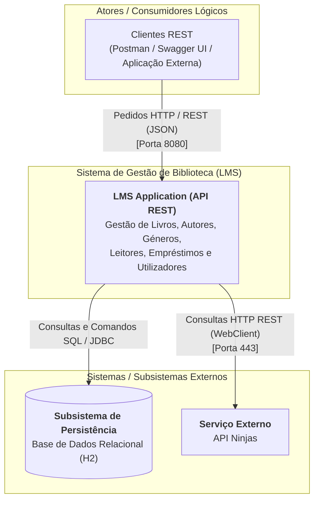

**Racional Arquitetural (VL N1):**
- O sistema LMS é disponibilizado exclusivamente como uma aplicação prestadora de serviços REST (*headless*).
- O LMS mantém duas dependências externas principais: uma para a sua camada de dados persistente (H2) e outra para o fornecedor de dados externos auxiliar (API Ninjas).

---

### 3.2 VL — Nível 2 (Decomposição em Camadas Lógicas do Monólito)
No Nível 2 da Vista Lógica, abre-se a caixa do LMS para evidenciar a sua decomposição interna em **Camadas Lógicas** e **Módulos Transversais** (*Cross-Cutting Concerns*).

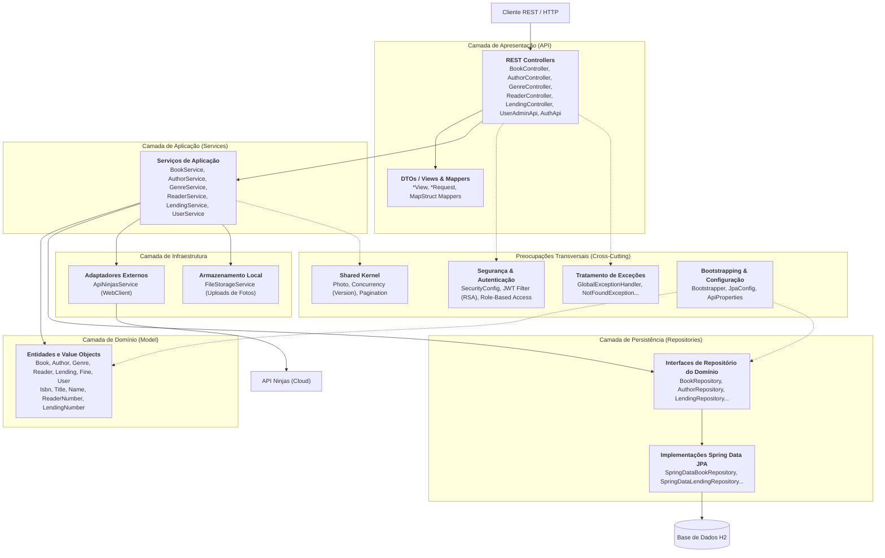

**Análise de Engenharia Inversa e Princípios SOLID (VL N2):**
- **Single Responsibility Principle (SRP):** Os Controllers limitam-se ao protocolo HTTP e validação inicial de payload; os Services coordenam os fluxos de aplicação; os Repositories gerem a recuperação e persistência dos dados.
- **Dependency Inversion Principle (DIP):** Os serviços de aplicação dependem de interfaces de repositório (`BookRepository`, `LendingRepository`), desacoplando o código de aplicação da tecnologia concreta de persistência.
- **Violação de Isolamento do Domínio:** As entidades de domínio (`Book`, `Author`, `Lending`) contêm anotações JPA diretas (`@Entity`, `@Table`, `@Embedded`, `@Id`). Isto evidencia um acoplamento direto do modelo de domínio à framework de persistência (afastando-se de uma arquitetura *Clean / Ports & Adapters* pura).
- **Violação de Open/Closed Principle (OCP):** As regras de negócio críticas (como validação de empréstimo: máximo 3 livros, bloqueio por atrasos) estão codificadas diretamente em `LendingServiceImpl`. O serviço de integração externa (`ApiNinjasService`) está acoplado diretamente a um único fornecedor, sem abstração polimórfica que permita plugar novos fornecedores em tempo de configuração.

---

## 4. Vista de Processos (VP)

A Vista de Processos demonstra o comportamento dinâmico do sistema em tempo de execução, especificando a troca de mensagens, o fluxo de controlo e a concorrência na execução de cenários.

### 4.1 VP — Nível 1 (System Sequence Diagram / Caixa Preta)
No Nível 1, o LMS é abordado como uma caixa preta. O diagrama de sequência de sistema (SSD) ilustra a interação entre o Ator humano e a fronteira do LMS via operações da API REST.

#### Cenário 1: Criar Livro (Bibliotecário)
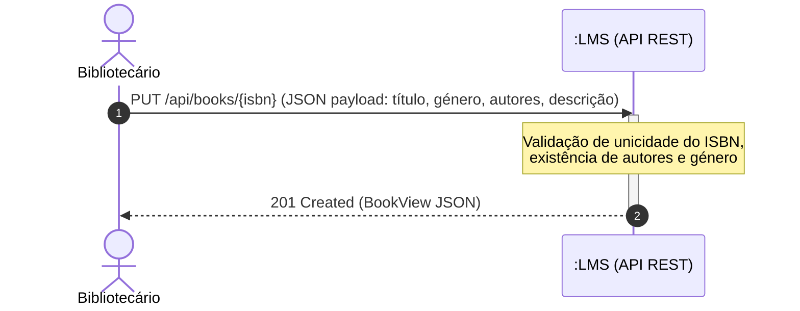

#### Cenário 2: Criar Empréstimo (Bibliotecário)
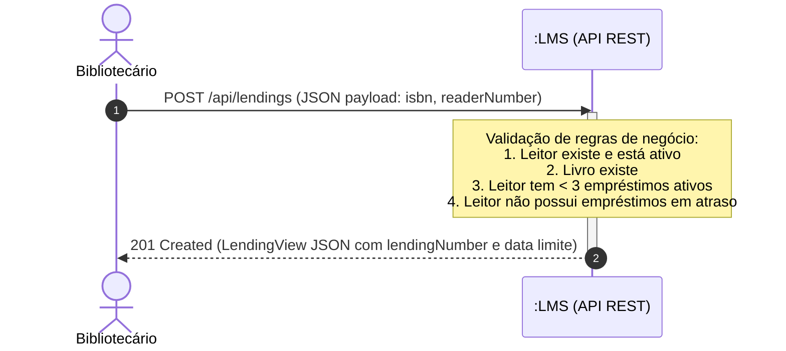

#### Cenário 3: Devolver Livro e Calcular Multa (Leitor / Bibliotecário)
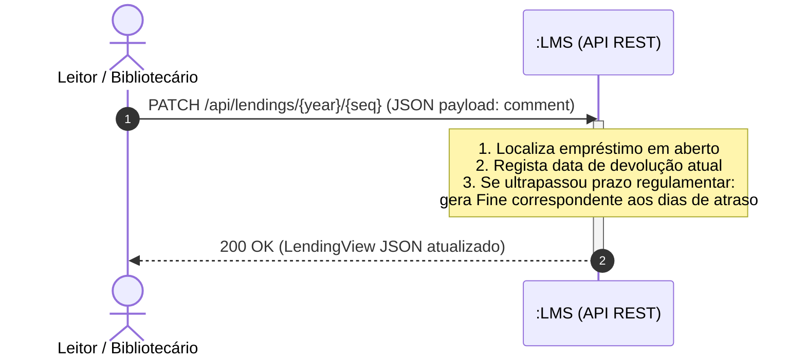

---

### 4.2 VP — Nível 2 (Interação entre Camadas e Contentores Lógicos)
No Nível 2, detalha-se o fluxo de execução interno entre as camadas de Apresentação, Aplicação, Domínio e Persistência para o cenário crítico **Criar Empréstimo**.

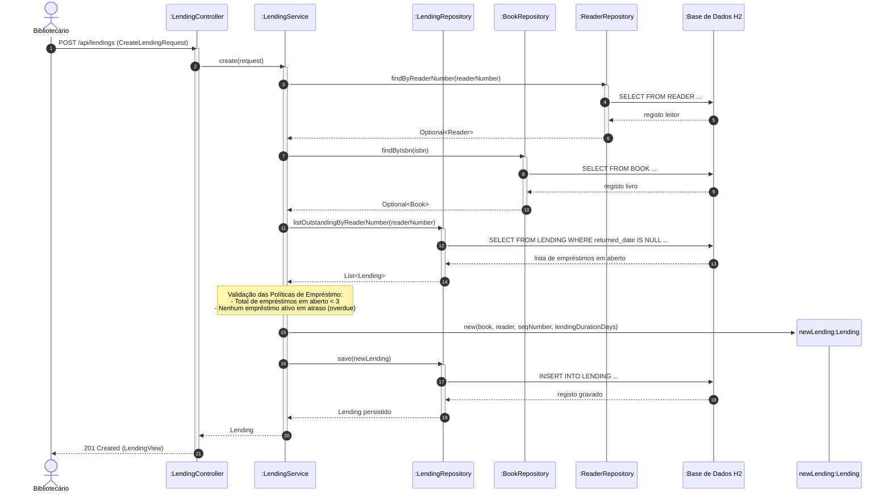

---

## 5. Vista de Implementação (VI) / Vista Arquitetural (VA)

A Vista de Implementação descreve a organização dos artefatos de código-fonte, módulos Maven, bibliotecas de terceiros e a estrutura de pacotes da aplicação Java.

### 5.1 VI — Nível 1 (Artefato Executável Global)
No Nível 1, a aplicação é empacotada num único artefato executável JAR gerado pelo Apache Maven. O LMS depende de bibliotecas e frameworks de suporte.

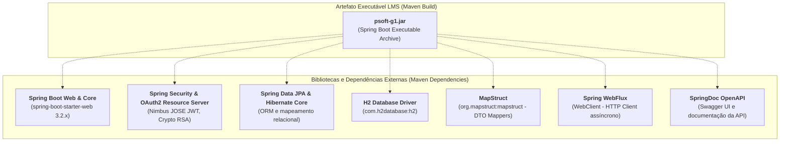

> [!TIP]
> **Racional de Equivalência N1 (VL vs. VI):**  
> A nível de N1, tanto a Vista Lógica como a de Implementação representam o sistema como uma fronteira indivisível. A diferença conceptual reside no facto de que na **VL N1** representamos o sistema conceptual de serviços de biblioteca, enquanto na **VI N1** representamos o **artefato de software compilado** (`psoft-g1.jar`) e as suas **dependências físicas de binários/bibliotecas**.

---

### 5.2 VI — Nível 2 (Estrutura de Pacotes — Screaming Architecture)
No Nível 2 da Vista de Implementação, analisa-se a estrutura de pacotes Java sob `src/main/java/pt/psoft/g1/psoftg1`.

O projeto adota o princípio de **Screaming Architecture** (*Package-by-Feature*): os pacotes de topo representam as capacidades e entidades de domínio da biblioteca, e não camadas arquiteturais globais (evita-se o antipadrão *package-by-layer* global).

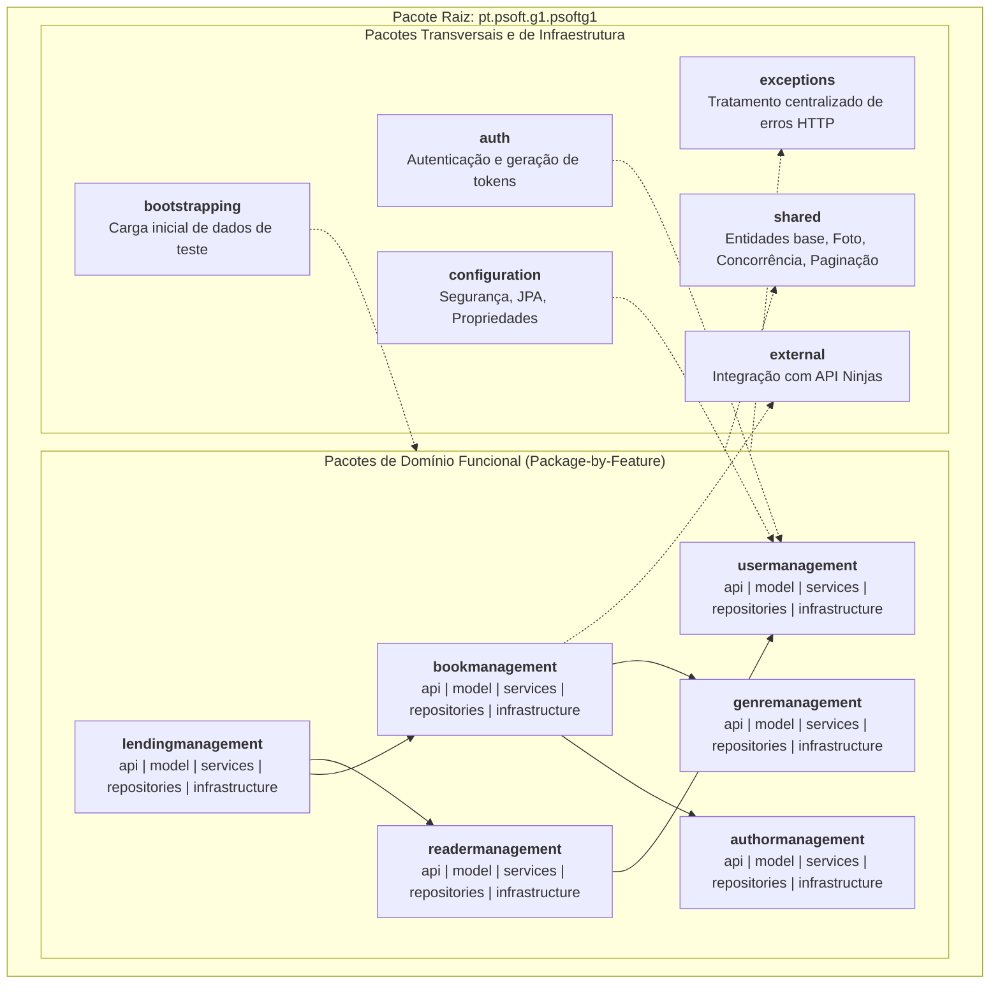

**Organização Interna dos Sub-Pacotes de Feature (Nível 3 antecipado):**
Cada pacote de domínio possui uma estrutura homogénea de 5 sub-pastas:
- `api`: Contém os REST Controllers (`*Controller`), os DTOs de entrada (`*Request`), DTOs de resposta (`*View`) e mapeadores MapStruct (`*ViewMapper`).
- `services`: Contém as interfaces de serviço de aplicação (`*Service`) e as suas implementações (`*ServiceImpl`).
- `model`: Contém as entidades de negócio e agregados (`Book`, `Lending`, `Author`), juntamente com os *Value Objects* (`Isbn`, `Title`, `Bio`, `ReaderNumber`).
- `repositories`: Contém as interfaces abstratas do repositório (`*Repository`).
- `infrastructure/repositories/impl/springdata`: Contém as implementações dos repositórios que acoplam a Spring Data JPA (`SpringData*Repository`).

---

## 6. Vista Física / Emplantação (VF)

A Vista Física (ou de Emplantação) ilustra a alocação dos componentes de software nos nós de hardware físico, máquinas virtuais ou processos do sistema operativo, documentando as portas e protocolos de comunicação física.

### 6.1 VF — Nível 1 (Topologia de Nós Físicos e Redes)
No Nível 1, identificam-se os nós físicos e de rede envolvidos no funcionamento da solução.

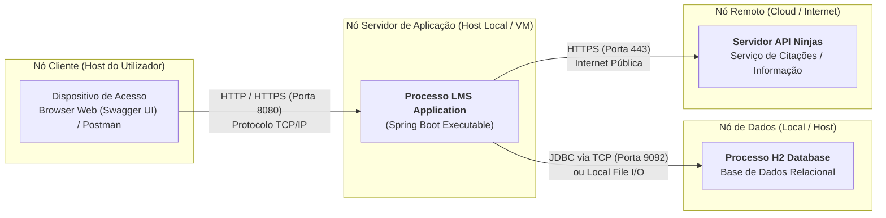

---

### 6.2 VF — Nível 2 (Ambiente de Execução, Processos e Portas)
No Nível 2, detalham-se os processos de sistema operativo, ambientes de execução (JVM), servidores web embebidos e o sistema de ficheiros local.

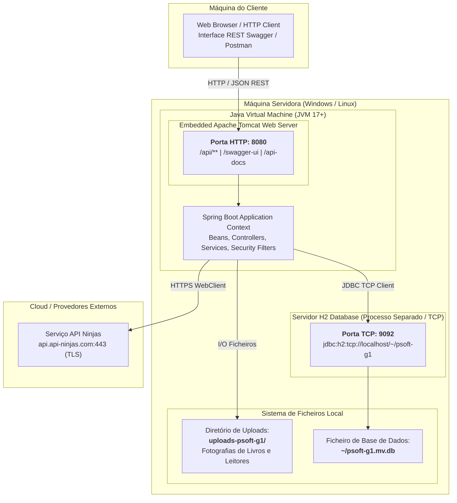

**Observações de Infraestrutura (VF):**
- O sistema atual é implantado num **nó único** (*Single-Node Deployment*), sem orquestração de contentores (Docker/Kubernetes) no projeto base.
- A base de dados H2 é acedida através de TCP (`jdbc:h2:tcp://localhost/~/psoft-g1`), o que requer a inicialização prévia do servidor TCP de H2 ou execução do processo em modo embedded.
- O armazenamento de fotografias de livros e leitores é efetuado diretamente no disco rígido local do servidor no diretório configurado `file.upload-dir=uploads-psoft-g1`.

---

## 7. Vista de Casos de Uso / Cenários (VC)

A Vista de Casos de Uso define os requisitos funcionais chave da perspetiva dos atores que interagem com o sistema, servindo como elemento unificador e de validação para as restantes vistas arquiteturais.

### 7.1 VC — Nível 1 (Visão Geral dos Casos de Uso do LMS)
No Nível 1, mapeiam-se os 4 atores identificados no sistema através da configuração de segurança (`SecurityConfig`) e os grandes agrupamentos de casos de uso da biblioteca.

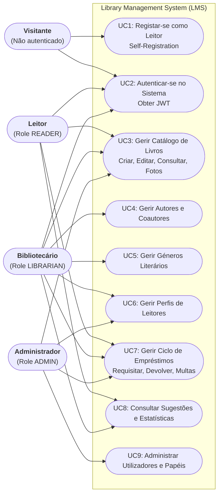

**Mapeamento de Acessos e Regras de Segurança (Engenharia Inversa de `SecurityConfig`):**
1. **Visitante (Não Registado):** Tem acesso público exclusivamente ao registo de leitores (`POST /api/readers`), ao endpoint de autenticação (`POST /api/public/login`) e à documentação OpenAPI (`/swagger-ui/**`).
2. **Leitor (READER):** Pode consultar o catálogo de livros e autores, pesquisar por título/autor, consultar os seus próprios dados de leitor, consultar sugestões de leitura personalizadas com base nos géneros mais requisitados, e marcar a devolução de um empréstimo seu (`PATCH /api/lendings/{year}/{seq}`).
3. **Bibliotecário (LIBRARIAN):** Cria novos livros (`PUT /api/books/{isbn}`), atualiza informação e fotos de livros, regista autores e géneros, cria novos empréstimos para leitores (`POST /api/lendings`), e consulta relatórios e estatísticas da biblioteca.
4. **Administrador (ADMIN):** Possui acesso privilegiado a todas as rotas e gere as contas de utilizadores do sistema (`/api/admin/user/**`).

---

### 7.2 VC — Nível 2 (Casos de Uso Detalhados de Gestão de Empréstimos e Catálogo)
No Nível 2, decompõem-se os fluxos mais críticos de negócio nos seus casos de uso específicos:

```mermaid
flowchart TB
    subgraph Lending_UseCases["Casos de Uso: Gestão de Empréstimos (lendingmanagement)"]
        L1(["Criar Novo Empréstimo<br/>POST /api/lendings"])
        L2(["Devolver Livro Emprestado<br/>PATCH /api/lendings/{year}/{seq}"])
        L3(["Consultar Empréstimos Ativos / Atrasados<br/>GET /api/lendings/overdue"])
        L4(["Consultar Detalhes e Multa de Empréstimo<br/>GET /api/lendings/{year}/{seq}"])
        L5(["Calcular Duração Média de Empréstimo<br/>GET /api/lendings/avgDuration"])
    end

    subgraph Book_UseCases["Casos de Uso: Catálogo de Livros (bookmanagement)"]
        B1(["Criar Livro com ISBN<br/>PUT /api/books/{isbn}"])
        B2(["Atualizar Livro<br/>PATCH /api/books/{isbn}"])
        B3(["Associar Fotografia da Capa<br/>PUT /api/books/{isbn}/photo"])
        B4(["Pesquisar Livros por Critérios<br/>POST /api/books/search"])
        B5(["Obter Top 5 Livros Mais Emprestados<br/>GET /api/books/top5"])
        B6(["Obter Sugestões de Livros por Leitor<br/>GET /api/books/suggestions"])
    end

    Librarian["Bibliotecário"]
    ReaderUser["Leitor"]

    Librarian --> L1
    Librarian --> L2
    Librarian --> L3
    Librarian --> L4
    Librarian --> L5
    Librarian --> B1
    Librarian --> B2
    Librarian --> B3
    Librarian --> B4
    Librarian --> B5

    ReaderUser --> L2
    ReaderUser --> L4
    ReaderUser --> B4
    ReaderUser --> B6
```

---

## 8. Diagnóstico Arquitetural do System-as-Is para o Projeto P1

A análise por engenharia inversa ao código-fonte do `psoft-g1` permitiu identificar as limitações arquiteturais concretas que motivam os requisitos de desenvolvimento do enunciado de ARQSOFT 2026/2027:

| Dimensão Requerida | Estado no System-as-Is | Problema Identificado | Requisito de Evolução (P1) |
| :--- | :--- | :--- | :--- |
| **Informação Bibliográfica Externa** | Existe apenas a classe `ApiNinjasService` no pacote `external`, chamada pontualmente. | Acoplamento rígido a uma API externa específica. Não suporta múltiplas fontes simultâneas nem escolha em tempo de configuração (*setup time*). | **1.3.3.1:** Suporte a Google Books e Open Library. Seleção em *setup time* (uma ou várias fontes). Adição de novas fontes com impacto mínimo. |
| **Notificações a Leitores** | Inexistente. A criação de empréstimo ou marcação de atraso apenas grava na BD, sem comunicação ao leitor. | Ausência de mecanismo de notificação desacoplado de eventos do ciclo de vida de empréstimos. | **1.3.3.2:** Notificação aos leitores via Email, SMS e Webhook (individuais ou combinados), configuráveis em *setup time*, extensível. |
| **Políticas de Empréstimo** | Parâmetros e validações codificados diretamente no código (*hard-coded*) em `LendingServiceImpl` (limite fixo de 3 livros, dias fixos). | Violação de OCP. Impossibilidade de alterar limites ou aplicar políticas distintas por tipo de leitor/época sem recompilar. | **1.3.3.3:** Políticas de empréstimo configuráveis externamente sem alteração de código, seleção em *runtime* e extensibilidade para novas políticas. |
| **Testabilidade e Qualidade** | Conjunto básico de testes unitários (`BookTest`, etc.) e integração com H2. | Cobertura insuficiente para regras de domínio complexas e falta de evidências de mutação. | **1.3.3.4:** Testes caixa opaca sobre classes, caixa transparente sobre domínio, mutation tests com PIT, testes integrados controller+service+gateway e testes de sistema. |

---

## 9. Próximos Passos (Roteiro para a Solução To-Be com ADD)

1. **Definição Formal dos ASRs (Architecturally Significant Requirements):**
   - Especificação dos cenários de qualidade para Extensibilidade, Configurabilidade e Testabilidade segundo o modelo de Bass et al.
2. **Aplicação do Método ADD (Attribute-Driven Design):**
   - Seleção de Táticas Arquiteturais:
     - *Encapsulamento e Intermediários* para fontes bibliográficas (Padrão **Gateway / Adapter**).
     - *Publish-Subscribe / Observer* ou *Event-Driven* para Notificações a Leitores (Spring Application Events ou Message Broker).
     - *Strategy / Policy / Abstract Factory* para Políticas de Empréstimo configuráveis dinamicamente.
3. **Documentação das Alternativas e Racional de Decisão:**
   - Comparação formal de padrões e estilos (ex.: Eventos Locais vs. Broker Assíncrono; Strategy vs. Rule Engine).
4. **Modelação das Vistas To-Be (N1, N2 e N3):**
   - Atualização das 5 vistas C4+1 refletindo as novas abstrações e pontos de extensão.
