# ARQSOFT — Documentação de Arquitetura (P1)

> **Projeto Base:** `psoft-g1` — Sistema de Gestão de Biblioteca (LMS — *Library Management System*).  
> **Unidade Curricular:** Arquitetura de Software (ARQSOFT), Mestrado em Engenharia Informática, ISEP.  
> **Âmbito:** Engenharia Reversa do *System-as-is*, Levantamento de Vistas Arquiteturais segundo o modelo **C4 + 4+1 Views** (Kruchten / Brown), Especificação de ASRs e Táticas ADD.

Este documento consolida a descrição arquitetural completa do *system-as-is* do LMS, obtida por análise e engenharia reversa do código-fonte real. Segue a abordagem combinada de **4+1 Vistas de Kruchten** com os níveis de granularidade do **Modelo C4** (Nível 1 a Nível 4):
* **Vista Arquitetural / Lógica (VA / VL)**: organização funcional, subsistemas, módulos de domínio e camadas internas.
* **Vista de Implementação (VI)**: estrutura física do código-fonte, módulos de subdomínio, infraestrutura de persistência e pacotes Java.
* **Mapeamento entre Vistas (*Manifestation*)**: rastreabilidade formal (`<<manifest>>`) entre conceitos lógicos e artefactos de implementação.
* **Vista Física / Implantação (VF)**: topologia de nós e processos em execução.
* **Vista de Processos (VP)**: realização dinâmica dos principais casos de uso através de diagramas de sequência.
* **ASRs (*Architecturally Significant Requirements*) & ADD**: especificação de requisitos arquiteturais e mapeamento para táticas de desenho.

---

## 1. System-as-is: Vista Arquitetural / Lógica (VA)

A Vista Arquitetural descreve a decomposição funcional e concetual do sistema, evidenciando as responsabilidades de negócio, os contratos de interface pública (*ball-and-socket*) e os limites de contexto segundo os princípios do *Domain-Driven Design* (DDD) e da *Clean Architecture*.

### 1.1 Nível 1 — Sistema Global (C4 Context)

No Nível 1, o LMS é visto como um bloco concetual único (*C4 System*).

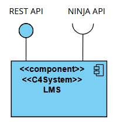

* **Interfaces Externas:**
  * **`REST API` (Provided `()`):** Interface HTTP/JSON exposta aos clientes externos (leitores, bibliotecários, administradores) para todas as operações da biblioteca.
  * **`NINJA API` (Required `)-`):** Interface externa consumida pelo LMS para obtenção de factos históricos e citações culturais.

---

### 1.2 Nível 2 — Decomposição em Subsistemas (C4 Container)

No Nível 2, o LMS decompõe-se nos seus dois subsistemas lógicos fundamentais.

* **Componentes:**
  * **`Backend`:** Núcleo aplicacional responsável por toda a lógica de negócio, controlo de acessos, orquestração de serviços e disponibilização dos endpoints REST.
  * **`DB`:** Repositório relacional persistente do sistema (servidor de base de dados H2).
* **Conexões e Portas:**
  * As portas na fronteira do `LMS` delegam o tráfego de entrada da `REST API` e a dependência de saída da `NINJA API` diretamente no componente `Backend`.
  * A comunicação entre `Backend` e `DB` realiza-se através da interface **`BD API`** (o `Backend` consome os serviços de dados fornecidos pelo container `DB`).

---

### 1.3 Nível 3 — Módulos de Domínio (Modular Monolith)

No Nível 3, o `Backend` é decomposto nos seus módulos de domínio funcionais, adotando o padrão arquitetural **Modular Monolith** orientado por domínios (DDD).

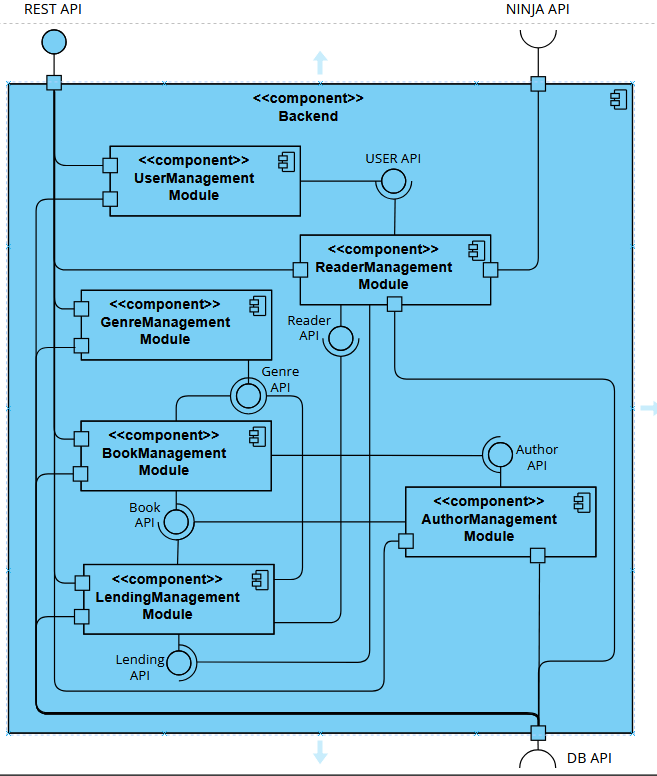

* **Módulos de Domínio:**
  * **`UserManagement Module`:** Gestão da identidade dos utilizadores, credenciais, palavras-passe e atribuição de perfis/autorizações (`ADMIN`, `LIBRARIAN`, `READER`).
  * **`ReaderManagement Module`:** Gestão do ciclo de vida cadastral dos leitores, números de leitor, dados pessoais e preferências.
  * **`BookManagement Module`:** Gestão do catálogo bibliográfico, títulos, ISBN, exemplares e associação a autores e géneros.
  * **`AuthorManagement Module`:** Gestão dos autores, biografias e relacionamento com as respetivas obras.
  * **`GenreManagement Module`:** Gestão da taxonomia de géneros literários e geração de estatísticas associadas.
  * **`LendingManagement Module`:** Gestão de operações de empréstimo, devoluções, cálculo de prazos e apuramento de multas (*fines*).

* **Interfaces Inter-Módulos (Ball-and-Socket):**
  * **`USER API`:** Fornecida por `UserManagement`, consumida por `ReaderManagement` (um leitor herda e especializa a identidade de utilizador).
  * **`Genre API`:** Fornecida por `GenreManagement`, consumida por `BookManagement` (classificação temática de livros) e por `LendingManagement` (métricas de empréstimo por género).
  * **`Author API`:** Fornecida por `AuthorManagement`, consumida por `BookManagement` (autoria das obras).
  * **`Book API`:** Fornecida por `BookManagement`, consumida por `LendingManagement` (validação de disponibilidade e requisição de exemplares).
  * **`Reader API`:** Fornecida por `ReaderManagement`, consumida por `LendingManagement` (validação de leitor elegível e histórico).
  * **`Lending API`:** Fornecida por `LendingManagement`, consumida por `ReaderManagement` (consulta do histórico de requisições de um leitor).
  * **`NINJA API`:** Consumida exclusivamente pelo `ReaderManagement` (através de `ApiNinjasService` no detalhe de leitor).
  * **`REST API`:** Encaminhada na fronteira para os controladores dos respetivos módulos de domínio.
  * **`DB API`:** Canal lógico de persistência que assegura o armazenamento relacional das entidades de domínio.

---

### 1.4 Nível 4 — Estrutura Interna de um Módulo (Clean Architecture)

No Nível 4, realiza-se o detalhe concetual interno de um módulo específico — **`UserManagement`** (`pt.psoft.g1.psoftg1.usermanagement`) — decompondo-o em 4 camadas concêntricas segundo o padrão **Clean Architecture / Onion Architecture**.

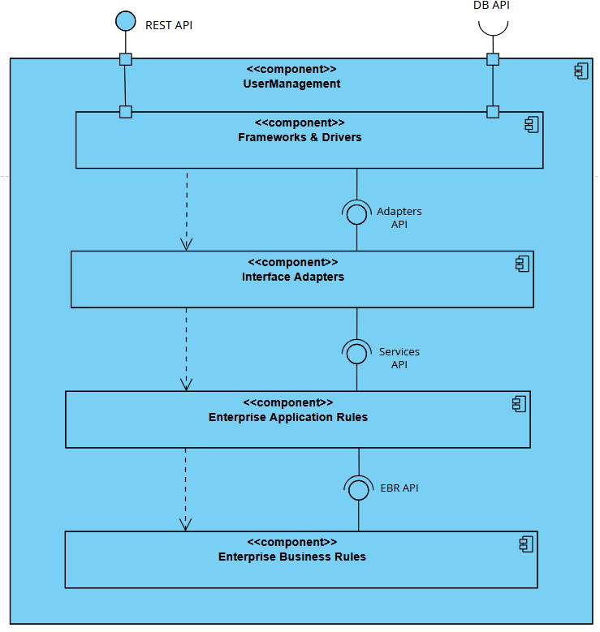

* **Regras de Dependência e DIP:**
  * As setas de dependência (`..>`) apontam estritamente de fora para dentro (*The Dependency Rule*). O modelo de domínio (`Enterprise Business Rules`) não conhece nenhuma classe ou framework exterior.
  * O princípio da inversão de dependência (*DIP*) assegura que o adaptador de persistência `SpringDataUserRepository` implementa a interface `UserRepository` definida na camada aplicacional/domínio, desacoplando o núcleo de negócio dos detalhes tecnológicos da base de dados.

---

## 2. System-as-is: Vista de Implementação (VI)

A Vista de Implementação descreve a organização estática do código-fonte, das unidades de compilação, dos subsistemas de empacotamento e da infraestrutura tecnológica concreta.

### 2.1 Nível 1 — Artefato Executável Global

No Nível 1, a aplicação é empacotada num único artefato executável JAR gerado pelo Apache Maven (`psoft-g1-0.0.1-SNAPSHOT.jar`), incorporando o Spring Boot Starter e o servidor Tomcat embutido.

* O executável expõe os pontos de terminação HTTP (`REST API`) e consome a biblioteca de cliente WebClient para conexão à `NINJA API`.

---

### 2.2 Nível 2 — Subsistemas de Implementação

No Nível 2, a arquitetura de implementação divide-se entre a base de código Java (`Backend`) e a unidade de gestão de dados relacional (`DB`).

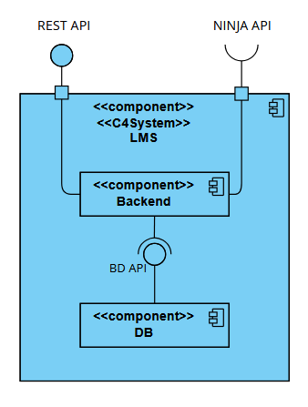

* O subsistema `Backend` acede ao subsistema `DB` através de ligações JDBC geridas pelo driver H2, satisfazendo a interface **`BD API`**.

---

### 2.3 Nível 3 — Módulos de Subdomínio e Subsistema de Persistência

No Nível 3, a base de código do `Backend` organiza-se em subsistemas de código correspondentes aos subdomínios funcionais e destaca o componente técnico de suporte transversal **`Persistência`**.

* **Componentes de Subdomínio (Código):**
  * `UserManagement SubDomain Module` (`pt.psoft.g1.psoftg1.usermanagement`)
  * `ReaderManagement SubDomain Module` (`pt.psoft.g1.psoftg1.readermanagement`)
  * `BookManagement SubDomain Module` (`pt.psoft.g1.psoftg1.bookmanagement`)
  * `AuthorManagement SubDomain Module` (`pt.psoft.g1.psoftg1.authormanagement`)
  * `GenreManagement SubDomain Module` (`pt.psoft.g1.psoftg1.genremanagement`)
  * `LendingManagement SubDomain Module` (`pt.psoft.g1.psoftg1.lendingmanagement`)

* **Componente de Infraestrutura Técnica de Persistência:**
  * **`Persistência`:** Centraliza a camada técnica partilhada de acesso a dados (configuração Spring Data JPA, `JpaConfig`, `EntityManagerFactory`, Hibernate ORM e repositórios concretos).
  * Disponibiliza a interface **`Persistence API`**, consumida através de soquetes por todos os módulos de subdomínio, consolidando a ligação relacional à base de dados através da porta **`DB API`**.

---

### 2.4 Nível 4 — Decomposição Física em Pacotes Java

No Nível 4, a estrutura de implementação descreve a árvore física de pacotes e tipos Java de um módulo de subdomínio (exemplificado em `usermanagement`):

---

## 3. Mapeamento e Rastreabilidade entre Vistas (*Manifestation*)

A rastreabilidade arquitetural assegura que cada conceito lógico abstrato da Vista Arquitetural encontra correspondência direta e inequívoca nos artefactos de software da Vista de Implementação através de relações `<<manifest>>`.

### 3.1 Mapeamento Nível 3 (VA N3 $\leftrightarrow$ VI N3)

O mapeamento de Nível 3 correlaciona os módulos de domínio funcionais (lógicos) com os módulos de código e com o subsistema técnico de persistência.

* **Racional Arquitetural:**
  * Cada módulo de subdomínio na VI manifesta o seu módulo funcional correspondente na VA (`VI: UserManagement` $\xrightarrow{\text{<<manifest>>}}$ `VA: UserManagement`, etc.).
  * O componente **`Persistência`** da VI manifesta a capacidade de persistência de **todos os módulos lógicos da VA**. Justifica como uma arquitetura monolítica modular partilha uma stack tecnológica comum de ORM e transações (Spring Data JPA / Hibernate) sem que cada módulo necessite de gerir uma base de dados autónoma.

### 3.2 Mapeamento Nível 4 (VA N4 $\leftrightarrow$ VI N4)

O mapeamento de Nível 4 correlaciona as 4 camadas concêntricas de *Clean Architecture* com os pacotes Java reais do módulo.

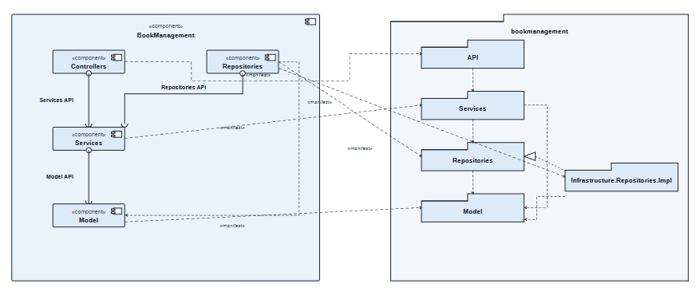

* `Frameworks & Drivers` $\leftarrow$ Configuração Spring Boot, `SecurityConfig`, `JpaConfig` e driver H2.
* `Interface Adapters` $\leftarrow$ Pacotes `api` e `infrastructure.repositories.impl`.
* `Enterprise Application Rules` $\leftarrow$ Pacote `services` e interfaces de `repositories`.
* `Enterprise Business Rules` $\leftarrow$ Pacote `model`.

---

## 4. System-as-is: Vista Física / Implantação (VF)

### 4.1 Nível 1
Um único nó de processamento físico local (*Node*) aloja a máquina virtual Java (JVM) que executa o processo completo do LMS.

### 4.2 Nível 2
O nó local é diferenciado em processos independentes em tempo de execução: o processo da aplicação Spring Boot (`Backend`) e o processo do motor H2 Server a escutar na porta TCP configurada.

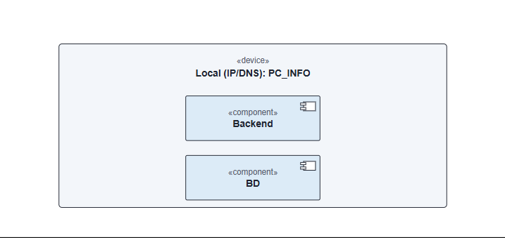

---

## 5. System-as-is: Vista de Processos (VP)

A realização dinâmica das operações é ilustrada através de diagramas de sequência para os três cenários de referência representativos.

### 5.1 Cenário 1: Criar Empréstimo (*Create Lending*)
Validação do leitor, verificação de limites ativos e empréstimos em mora (`LendingForbiddenException` $\rightarrow$ 403), consulta de disponibilidade da obra e registo do novo empréstimo.

* **Nível 1:**  
  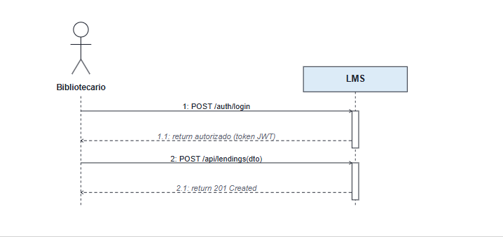
* **Nível 2:**  
  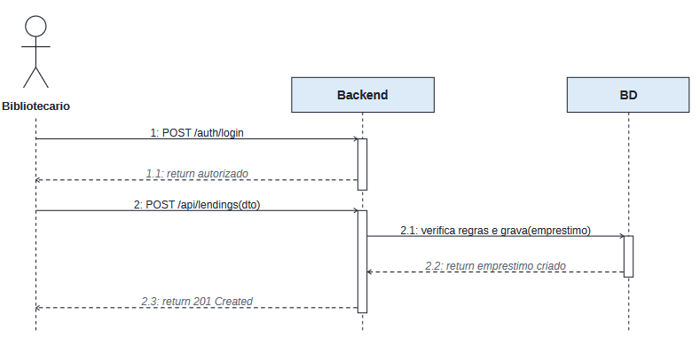
* **Nível 3:**  
  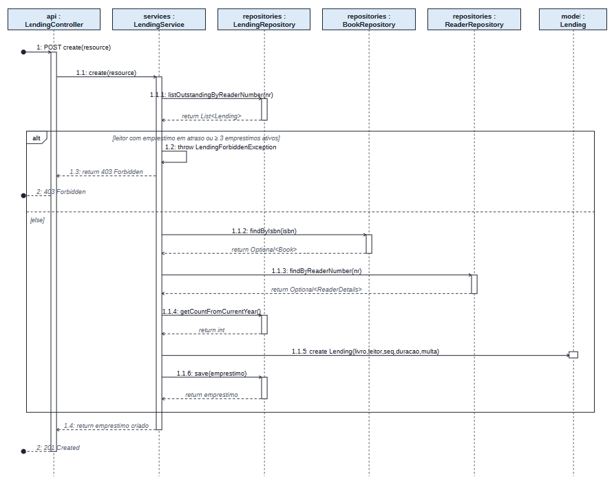

### 5.2 Cenário 2: Registar Livro (*Register Book*)
Verificação de unicidade de ISBN (`ConflictException` $\rightarrow$ 409), validação de existência prévia de autores e género literário (`NotFoundException` $\rightarrow$ 404), instanciação da entidade e persistência transacional.

* **Nível 1:**  
  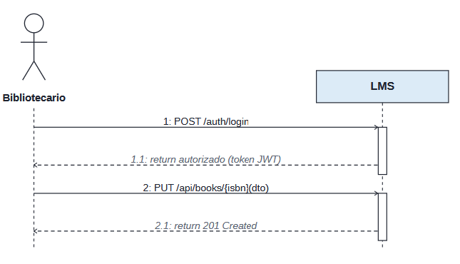
* **Nível 2:**  
  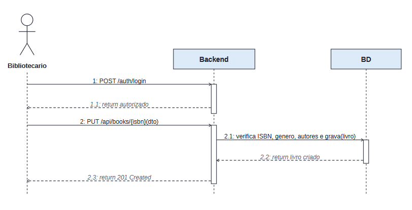
* **Nível 3:**  
  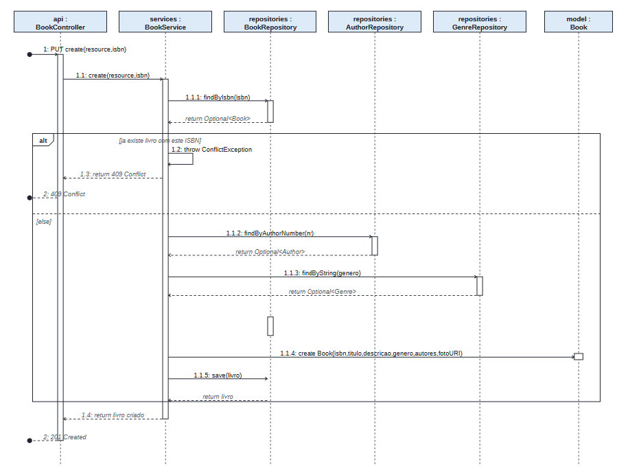

### 5.3 Cenário 3: Consulta Top 5 Géneros Literários (*Top 5 Genres*)
Operação analítica paginada de leitura, demonstrando consulta otimizada sem alteração de estado nem criação de novos objetos de negócio.

* **Nível 1:**  
  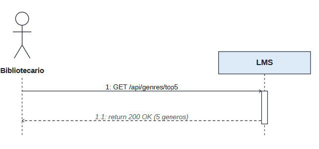
* **Nível 2:**  
  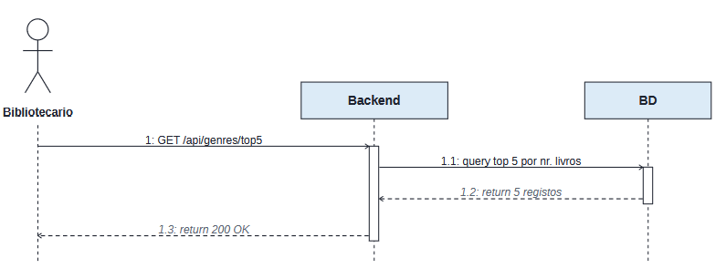
* **Nível 3:**  
  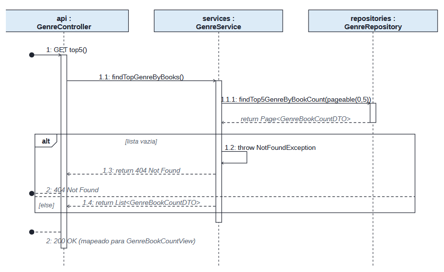

---

## 6. ASR (Architecturally Significant Requirements)

### 6.1 Requisitos Funcionais Globais (FR)

* **FR01 – Gestão do Catálogo de Livros (*Books*):** Registar, editar, consultar e listar livros do catálogo (ISBN, título, autores, descrição, géneros literários).
* **FR02 – Gestão de Autores e Géneros (*Authors & Genres*):** Manter o registo biográfico de autores e a taxonomia de géneros literários associados aos livros.
* **FR03 – Gestão de Leitores (*Readers*):** Gerir o ciclo de vida cadastral dos leitores (dados cadastrais, preferências de notificação).
* **FR04 – Gestão de Empréstimos (*Lendings*):** Criar e devolver empréstimos de livros a leitores, validando disponibilidade de exemplares e limites de requisição.
* **FR05 – Obtenção de Metadados Bibliográficos Externos:** Integrar informação bibliográfica a partir de múltiplos fornecedores externos (ex.: Google Books, Open Library), harmonizando modelos de dados heterogéneos.
* **FR06 – Notificação a Leitores:** Notificar leitores sobre eventos relevantes de empréstimo (criação de empréstimo, aviso de devolução, atraso) via SMS, Email e/ou Webhook.
* **FR07 – Aplicação de Políticas de Empréstimo Dinâmicas:** Avaliar e aplicar regras e limites de empréstimo (duração, máximo de livros simultâneos, cálculo de multas) com base no perfil do leitor ou tipo de obra.

---

### 6.2 Especificação dos ASRs (*Quality Attribute Scenarios*)

#### ASR01: Extensibilidade de Fontes Bibliográficas
* **Atributo de Qualidade:** Modificabilidade (*Modifiability / Extensibility*)
* **Estímulo:** Necessidade de suportar um novo fornecedor de metadados bibliográficos (ex.: Worldcat, Biblioteca Nacional).
* **Fonte do Estímulo:** Equipa de desenvolvimento / Operações.
* **Ambiente:** Tempo de desenho/desenvolvimento (*Design time*).
* **Artefacto:** Módulo de integração bibliográfica / Serviços externos.
* **Resposta:** O novo fornecedor é adicionado através de uma nova implementação de interface (*Adapter/Gateway*), sem alterar a lógica de negócio principal nem as fontes existentes.
* **Medida de Resposta:**
  * Custo/esforço de implementação reduzido (impacto isolado numa única classe/pacote);
  * Zero alterações ao código do domínio ou de apresentação (princípio Aberto/Fechado - OCP).

---

#### ASR02: Configurabilidade de Provedores em *Setup Time*
* **Atributo de Qualidade:** Configurabilidade (*Configurability*)
* **Estímulo:** O operador/administrador pretende ativar um ou múltiplos fornecedores de informação bibliográfica ou canais de notificação no arranque do serviço.
* **Fonte do Estímulo:** Administrador de sistemas / DevOps.
* **Ambiente:** Tempo de configuração/arranque (*Setup time / Deployment*).
* **Artefacto:** Ficheiros de configuração da aplicação (`application.properties` / `application.yml` / variáveis de ambiente).
* **Resposta:** A aplicação lê a configuração no arranque e instancia/injeta os adaptadores pretendidos sem requerer recompilação de código.
* **Medida de Resposta:**
  * Nenhuma alteração ao código-fonte ou reconstrução de binários (`.jar`);
  * O sistema arranca com a configuração selecionada em menos de 1 minuto.

---

#### ASR03: Notificações Multicanal Extensíveis
* **Atributo de Qualidade:** Modificabilidade (*Modifiability*)
* **Estímulo:** Ocorrência de um evento de empréstimo que exige notificação através de Email, SMS, Webhook ou qualquer combinação destes.
* **Fonte do Estímulo:** Processamento de eventos de domínio (*Lending events*).
* **Ambiente:** Tempo de execução e tempo de configuração.
* **Artefacto:** Módulo de Notificações / Event Handlers.
* **Resposta:** O sistema despacha a notificação para todos os canais configurados de forma desacoplada do fluxo principal de empréstimo.
* **Medida de Resposta:**
  * A introdução de um canal adicional (ex.: Slack/Push) não afeta a lógica do subdomínio `Lendings`;
  * Canais podem ser ativados individualmente ou em conjunto via configuração.

---

#### ASR04: Seleção Dinâmica de Políticas de Empréstimo em *Runtime*
* **Atributo de Qualidade:** Flexibilidade de Negócio / Configurabilidade em *Runtime*
* **Estímulo:** Um leitor solicita um empréstimo e o sistema tem de determinar as regras aplicáveis (prazos, limites) de acordo com o contexto do leitor/livro.
* **Fonte do Estímulo:** Pedido de empréstimo vindo de um leitor.
* **Ambiente:** Tempo de execução (*Runtime*).
* **Artefacto:** Mecanismo de políticas de empréstimo (*Lending Policy Engine*).
* **Resposta:** O sistema avalia as regras de seleção de políticas e executa a política correspondente, permitindo ainda que os limites numéricos sejam calibrados externamente em *setup time*.
* **Medida de Resposta:**
  * A seleção da política correta ocorre em *runtime* sem impacto percetível na latência do pedido HTTP;
  * Os parâmetros de limiares (ex.: dias de empréstimo, multas) são lidos da configuração externa sem alterar classes Java.

---

#### ASR05: Testabilidade e Isolamento de Componentes
* **Atributo de Qualidade:** Testabilidade (*Testability*)
* **Estímulo:** Realização de bateria de testes automatizados (unidade, domínio transparente, mutação, integração e sistema) sobre as novas funcionalidades.
* **Fonte do Estímulo:** Pipeline de CI/CD ou comando local de desenvolvimento (`mvn test`).
* **Ambiente:** Tempo de build / Teste automatizado.
* **Artefacto:** Conjunto de testes automatizados e arquitetura de classes.
* **Resposta:** A arquitetura desacoplada permite testar as regras de domínio e as políticas isoladamente, simular/mockar os serviços externos (Google Books, gateways de email/SMS) e validar caixas opacas e transparentes com testes de mutação representativos.
* **Medida de Resposta:**
  * As classes de domínio são 100% testáveis sem necessidade de arrancar contexto Spring ou base de dados;
  * Alta taxa de mutantes mortos (*mutation test score*) nas classes críticas de negócio;
  * Testes de integração ($SUT = \text{controller} + \text{service} + \text{gateways}$) executam de forma determinística utilizando mocks/stubs para as APIs externas.

---

### 6.3 Mapeamento para Táticas Arquiteturais (ADD)

| ASR | Atributo de Qualidade | Tática Arquitetural (SEI / ADD) | Padrão / Solução Concreta |
| :--- | :--- | :--- | :--- |
| **ASR01** | Modificabilidade | *Abstract Common Services* / *Maintain Abstract Interfaces* | Padrão **Adapter** e **Gateway/Repository** para as APIs externas (Google Books, Open Library). |
| **ASR02** | Configurabilidade | *Defer Binding Time* / *Configuration Files* | Injeção condicional no Spring (`@ConditionalOnProperty`, `@ConfigurationProperties`). |
| **ASR03** | Modificabilidade | *Publish-Subscribe* / *Separate Concerns* | Padrão **Observer / Domain Events** combinado com o padrão **Composite** para múltiplos canais. |
| **ASR04** | Configurabilidade / Modificabilidade | *Defer Binding Time* / *Use an Intermediary* | Padrão **Strategy** em conjunto com **Factory / Specification** para resolução das políticas em runtime. |
| **ASR05** | Testabilidade | *Specialized Interfaces* / *Record/Playback* | Inversão de Controlo (IoC), Injeção de Dependências e Mocks para componentes externos. |