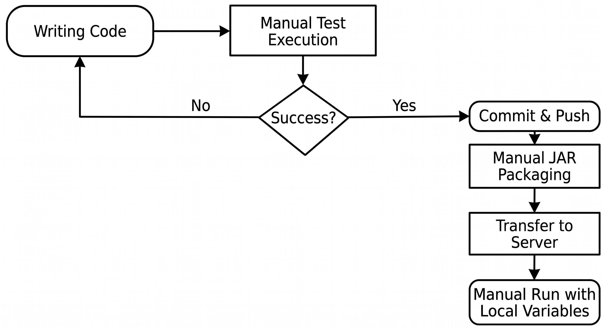

# System-as-is and Baseline

## 1. Implementation and Deployment

### 1.1. Technology Stack and Configuration
- **Framework & Language:** Java 17, Spring Boot 3.2.5.
- **Dependency Management:** Maven (local wrapper currently incomplete due to missing `maven-wrapper.properties` file).
- **Database:** H2 in-memory and local file, configured through `application.properties` (base credentials exposed). The data schema is automatically generated on startup.
- **Authentication:** Based on JWT tokens. Dependent on cryptographic keys (`rsa.private.key` and `rsa.public.key`) stored at the root of the resources directory.
- **Uploads:** Local configuration supported with a static directory (`uploads-psoft-g1`) and size restrictions (max 215MB overall, individual files up to 20KB).

### 1.2. Current Deployment Process (Manual)
The current process for deploying a new version is not automated and requires the following manual steps:
1. Repository synchronization by the developer.
2. Building the executable artifact through the `mvn clean package` command.
3. Manual transfer of the final artifact (`.jar`) and respective keys/configurations to the target environment.
4. Manual execution via server (`java -jar`).

## 2. Existing Build and Testing Practices

### 2.1. Workflow
- **Build:** The code is compiled only upon developer request, through local commands (`mvn clean compile` or IDE).
- **Testing:** Executed manually before commits, using the IDE or the terminal (`mvn test`).
- **Automated Validation (CI/CD):** Completely nonexistent. There are no automated blocks for commits with broken code or failing tests.

### 2.2. Process Diagram (As-Is)

## 3. Test Quantity, Coverage, and Effectiveness

The application's tests are based on JUnit and focus on two fundamental application layers (Domain and System Integration).

| Metric | Baseline Value | Observations |
| :--- | :--- | :--- |
| **Total Tests** | 102 | All operational (0 failures reported in the baseline). |
| **Unit Tests** | ~85 | Focus on Domain business rules and Value Objects. |
| **Integration Tests** | ~17 | Focus on Database (H2) communication, internal services, and HTTP validation. |
| **Execution Time** | ~65 Seconds | Variable, dependent on the developer's local environment. |
| **Coverage** | Unavailable | Lack of automated reports. Plugins like JaCoCo are not configured in the build process. |
| **Effectiveness (Mutation)** | Unavailable | Absence of Mutation Testing (e.g., PIT). It is currently impossible to validate the robustness of tests against inserted defects. |

## 4. Relevant Software Quality Indicators

The analysis of the workflow reveals the following current indicators of software and process quality:

| Indicator | Status | Risk and Assessment |
| :--- | :--- | :--- |
| **Continuous Integration (CI)** | Nonexistent | **High:** Regressions are not detected early; commits are prone to breaking the main branch. |
| **Continuous Deployment (CD)** | Nonexistent | **Medium:** Deliveries are slow, repetitive, and prone to human error. |
| **Static Code Analysis** | Nonexistent | **Medium:** Inability to automatically measure technical debt (no configuration for Checkstyle, SpotBugs, or SonarQube). |
| **Environment Reproducibility**| Low | **High:** High dependency on the local machine. Lack of explicit Dockerization or containerization for environments (Dev/Staging/Prod). |
| **Secrets Management** | Vulnerable | **High:** Local secrets (e.g., `rsa.private.key`) integrated directly into the version repository, with shared unsecured keys. |
