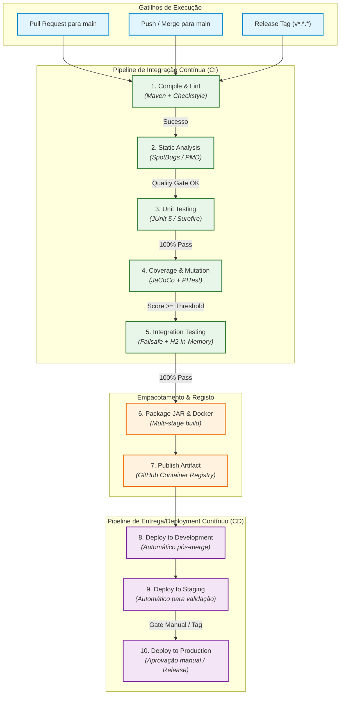

# System-to-Be: Target Development and Deployment Process

> **Project:** Library Management System (LMS) — `psoft-g1`  
> **Course:** Software Development Organization (ODSOFT) — 2026/2027  
> **Goal:** Design the target development and deployment process, documenting the relevant system-to-be and the engineering decisions supporting its design (US-OD02).

---

## 1. Target Development and CI/CD Pipeline Architecture (Ponto 1)

### 1.1. Overview and Core Principles
The target development process transitions the team from a manual, error-prone, and unmonitored workflow to an **automated, repeatable, and measurable Continuous Integration & Continuous Delivery (CI/CD)** pipeline.

Key design principles of the target process:
* **Fail Fast & Immediate Feedback:** Errors (compilation, syntax, security violations, test regressions) are detected within minutes of a developer pushing code.
* **Strict Quality Gates:** No code reaches the main branch (`main`) without passing static analysis, automated unit/integration tests, minimum code coverage thresholds, and mutation test verification.
* **Immutable & Reproducible Artifacts:** Software packages (JAR and OCI/Docker images) are built once in the pipeline, cryptographically hashed, and promoted across environments without recompilation.
* **Automated Traceability:** Every build artifact is linked back to a specific Git commit SHA and workflow run ID.

---

### 1.2. Pipeline Stages Specification

The target CI/CD pipeline is triggered on:
1. **Pull Requests** targeting `main` (verification and gatekeeping).
2. **Push / Merge** to `main` (packaging, artifact publishing, and automated deployment).
3. **Release Tags** (`v*.*.*`) for official release management.

| Stage # | Stage Name | Purpose | Tooling | Input | Output Artifact | Approval Criteria | Fail Action |
| :---: | :--- | :--- | :--- | :--- | :--- | :--- | :--- |
| **1** | **Checkout & Environment Setup** | Provision clean runner and JDK environment | GitHub Actions, JDK 17 (Temurin) | Repository code | Initialized runner environment | Successful JDK & Maven cache setup | Terminate workflow |
| **2** | **Compile & Linting** | Verify code syntax, annotation processors, and style guide | Apache Maven (`mvn compile`), Spotless / Checkstyle | Source code (`src/main/java`) | Compiled bytecode (`target/classes`) | 0 compilation errors, 0 style violations | Block PR / Fail build |
| **3** | **Static Code Analysis (SAST)** | Detect security vulnerabilities, code smells, and bugs | SpotBugs, PMD, SonarCloud | Compiled bytecode & source | SAST reports (`spotbugsXml.xml`) | 0 high-severity bugs, 0 security vulnerabilities | Block PR / Fail build |
| **4** | **Automated Testing (Unit & Domain)** | Validate business domain invariants and application logic | JUnit 5, Mockito, `maven-surefire-plugin` | Unit test suite (`src/test/java`) | Surefire XML/HTML test reports | 100% test pass rate (0 failures, 0 errors) | Block PR / Fail build |
| **5** | **Code Coverage & Mutation Testing** | Measure test thoroughness and fault-detection capability | JaCoCo, PITest (`pitest-maven`) | Bytecode & test suites | JaCoCo execution data (`jacoco.exec`), PIT report | JaCoCo Line Coverage $\ge 60\%$, Mutation Score $\ge 50\%$ | Block PR / Alert on regressions |
| **6** | **Integration & API Testing** | Test repository queries, Spring context, and REST contracts | `maven-failsafe-plugin`, Testcontainers / in-memory H2 | SUT + integration test classes | Failsafe XML/HTML test reports | 100% integration test pass rate | Block PR / Fail build |
| **7** | **Packaging & Containerization** | Build immutable, production-ready deployable artifacts | `spring-boot-maven-plugin`, Docker multi-stage build | Verified code & dependencies | Standalone JAR & OCI Docker Image | Successful image build, image vulnerability scan | Terminate pipeline |
| **8** | **Artifact Publishing** | Store and version deployable packages | GitHub Packages / GitHub Releases / GH Actions Artifacts | Built JAR & Docker image | Tagged container image, versioned JAR asset | Successful upload to artifact registry | Terminate pipeline |
| **9** | **Continuous Deployment** | Deploy to target environments according to promotion gates | SSH / Docker Compose / Cloud runner | Container image & env config | Running application instance | HTTP 200 on `/actuator/health` | Automated Rollback to last stable version |

---

### 1.3. Target Pipeline Workflow Diagram

---

### 1.4. Quality Gates and Enforcement Rules

To eliminate the manual oversights identified in the *system-as-is*, the target CI process enforces automated gates:
1. **Compilation Gate:** Zero warnings treated as errors where applicable; builds must be reproducible under clean JDK 17 environments.
2. **Test Quality Gate:** Any regression or broken test immediately halts the pipeline (*Break the Build* principle).
3. **Code Coverage Gate (JaCoCo):** Minimum global line coverage target set to **60%** on new code, ensuring that domain rules and controllers are exercised.
4. **Mutation Testing Gate (PIT):** Mutation threshold of **50%** on core domain and service packages, preventing survival of mutants that alter critical library rules (such as loan limits or fine calculations).
5. **Static Analysis Gate:** Zero high-priority bugs reported by SpotBugs.

---

<!-- ========================================================================= -->
<!-- PONTO 2: Target Deployment Process & Environment Strategy                 -->
<!-- (A preencher pelo Colega 1 / Daniel)                                      -->
<!-- ========================================================================= -->

## 2. Target Deployment Process and Environments Strategy (Ponto 2)

*(Secção reservada para o Colega 1: definição dos ambientes Development, Staging e Production, gestão de segredos, configuração de contentores Docker, Docker Compose e estratégias de promoção e rollback).*

---

<!-- ========================================================================= -->
<!-- PONTO 3: Architectural Decision Records (ADRs)                            -->
<!-- (A preencher pelo Colega 2 / Gonçalo)                                     -->
<!-- ========================================================================= -->

## 3. Engineering Decisions Supporting the Design (Ponto 3 - ADRs)

*(Secção reservada para o Colega 2: formalização dos ADRs justificando escolhas de ferramentas: GitHub Actions, Docker, JaCoCo/PIT, H2 in-memory vs TCP, e Branching Strategy).*

