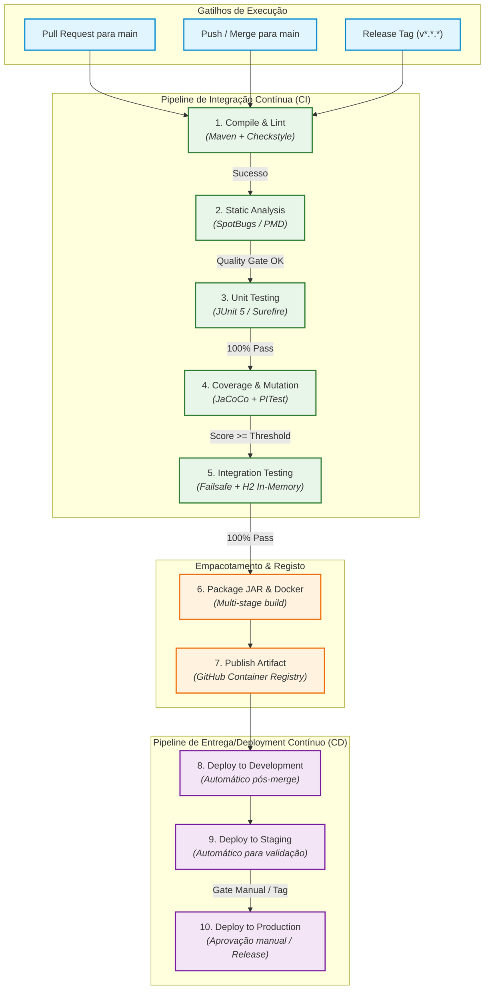

# System-to-Be: Target Development and Deployment Process

> **Project:** Library Management System (LMS) — `psoft-g1`  
> **Course:** Software Development Organization (ODSOFT) — 2026/2027  
> **Goal:** Design the target development and deployment process, documenting the relevant system-to-be and the engineering decisions supporting its design (US-OD02).

---

## 1. Target Development and CI/CD Pipeline Architecture (Ponto 1)

### 1.1. Overview and Core Principles
The target development process transitions the team from a manual, error-prone, and unmonitored workflow to an **automated, repeatable, and measurable Continuous Integration & Continuous Delivery (CI/CD)** pipeline.

Key design principles of the target process:
* **Fail Fast & Immediate Feedback:** Errors (compilation, syntax, security violations, test regressions) are detected within minutes of a developer pushing code.
* **Strict Quality Gates:** No code reaches the main branch (`main`) without passing static analysis, automated unit/integration tests, minimum code coverage thresholds, and mutation test verification.
* **Immutable & Reproducible Artifacts:** Software packages (JAR and OCI/Docker images) are built once in the pipeline, cryptographically hashed, and promoted across environments without recompilation.
* **Automated Traceability:** Every build artifact is linked back to a specific Git commit SHA and workflow run ID.

---

### 1.2. Pipeline Stages Specification

The target CI/CD pipeline is triggered on:
1. **Pull Requests** targeting `main` (verification and gatekeeping).
2. **Push / Merge** to `main` (packaging, artifact publishing, and automated deployment).
3. **Release Tags** (`v*.*.*`) for official release management.

| Stage # | Stage Name | Purpose | Tooling | Input | Output Artifact | Approval Criteria | Fail Action |
| :---: | :--- | :--- | :--- | :--- | :--- | :--- | :--- |
| **1** | **Checkout & Environment Setup** | Provision clean runner and JDK environment | GitHub Actions, JDK 17 (Temurin) | Repository code | Initialized runner environment | Successful JDK & Maven cache setup | Terminate workflow |
| **2** | **Compile & Linting** | Verify code syntax, annotation processors, and style guide | Apache Maven (`mvn compile`), Spotless / Checkstyle | Source code (`src/main/java`) | Compiled bytecode (`target/classes`) | 0 compilation errors, 0 style violations | Block PR / Fail build |
| **3** | **Static Code Analysis (SAST)** | Detect security vulnerabilities, code smells, and bugs | SpotBugs, PMD, SonarCloud | Compiled bytecode & source | SAST reports (`spotbugsXml.xml`) | 0 high-severity bugs, 0 security vulnerabilities | Block PR / Fail build |
| **4** | **Automated Testing (Unit & Domain)** | Validate business domain invariants and application logic | JUnit 5, Mockito, `maven-surefire-plugin` | Unit test suite (`src/test/java`) | Surefire XML/HTML test reports | 100% test pass rate (0 failures, 0 errors) | Block PR / Fail build |
| **5** | **Code Coverage & Mutation Testing** | Measure test thoroughness and fault-detection capability | JaCoCo, PITest (`pitest-maven`) | Bytecode & test suites | JaCoCo execution data (`jacoco.exec`), PIT report | JaCoCo Line Coverage $\ge 60\%$, Mutation Score $\ge 50\%$ | Block PR / Alert on regressions |
| **6** | **Integration & API Testing** | Test repository queries, Spring context, and REST contracts | `maven-failsafe-plugin`, Testcontainers / in-memory H2 | SUT + integration test classes | Failsafe XML/HTML test reports | 100% integration test pass rate | Block PR / Fail build |
| **7** | **Packaging & Containerization** | Build immutable, production-ready deployable artifacts | `spring-boot-maven-plugin`, Docker multi-stage build | Verified code & dependencies | Standalone JAR & OCI Docker Image | Successful image build, image vulnerability scan | Terminate pipeline |
| **8** | **Artifact Publishing** | Store and version deployable packages | GitHub Packages / GitHub Releases / GH Actions Artifacts | Built JAR & Docker image | Tagged container image, versioned JAR asset | Successful upload to artifact registry | Terminate pipeline |
| **9** | **Continuous Deployment** | Deploy to target environments according to promotion gates | SSH / Docker Compose / Cloud runner | Container image & env config | Running application instance | HTTP 200 on `/actuator/health` | Automated Rollback to last stable version |

---

### 1.3. Target Pipeline Workflow Diagram



---

### 1.4. Quality Gates and Enforcement Rules

To eliminate the manual oversights identified in the *system-as-is*, the target CI process enforces automated gates:
1. **Compilation Gate:** Zero warnings treated as errors where applicable; builds must be reproducible under clean JDK 17 environments.
2. **Test Quality Gate:** Any regression or broken test immediately halts the pipeline (*Break the Build* principle).
3. **Code Coverage Gate (JaCoCo):** Minimum global line coverage target set to **60%** on new code, ensuring that domain rules and controllers are exercised.
4. **Mutation Testing Gate (PIT):** Mutation threshold of **50%** on core domain and service packages, preventing survival of mutants that alter critical library rules (such as loan limits or fine calculations).
5. **Static Analysis Gate:** Zero high-priority bugs reported by SpotBugs.

---

<!-- ========================================================================= -->
<!-- PONTO 2: Target Deployment Process & Environment Strategy                 -->
<!-- (A preencher pelo Colega 1 / Daniel)                                      -->
<!-- ========================================================================= -->

## 2. Target Deployment Process and Environments Strategy (Ponto 2)

### 2.1. Environment Structure and Parity (Estrutura e Paridade de Ambientes)

To overcome the fragility and lack of reproducibility identified in the *system-as-is* analysis (where execution depended on developers' local machines, unmanaged file paths, and manual steps), the target deployment architecture formally defines three isolated environments. 

Following the **Twelve-Factor App methodology (Factor X: Dev/Prod Parity)**, these environments maximize runtime parity by sharing identical operating systems, JVM versions, and containerized deployment mechanisms, differing solely in configuration, capacity, and security constraints.

```
+---------------------------------------------------------------------------------------------------------+
|                                    ENVIRONMENT LIFECYCLE & PARITY                                      |
+---------------------------------------------------------------------------------------------------------+
|  1. DEVELOPMENT (Dev)           |  2. STAGING (Stg)                |  3. PRODUCTION (Prod)              |
|  - Scope: Local & CI Runners    |  - Scope: Pre-production QA      |  - Scope: Live End-User System     |
|  - DB: In-Memory H2 (Fast/Mock) |  - DB: Persistent Volume Replica |  - DB: Persistent Hardened Storage |
|  - Port: 8080                   |  - Port: 8081 (Isolated)         |  - Port: 8080 (Behind Reverse Proxy|
|  - Profiles: dev, bootstrap     |  - Profiles: staging             |  - Profiles: prod                  |
|  - Logs: Verbose (DEBUG)        |  - Logs: Structured (INFO)       |  - Logs: Minimal / Audit (WARN)    |
|  - Health: Full Actuator        |  - Health: Actuator Probes       |  - Health: Actuator (Protected)    |
+---------------------------------------------------------------------------------------------------------+
```

#### 2.1.1. Development Environment (`dev`)
* **Purpose and Target:** Intended for day-to-day software development, rapid local debugging, feature iteration, and automated CI test execution runners.
* **Database & Persistence:** Employs an autonomous in-memory H2 database (`jdbc:h2:mem:testdb;DB_CLOSE_DELAY=-1;IGNORECASE=TRUE`). The database lifecycle is strictly ephemeral (recreated on every application bootstrap), eliminating dependencies on external processes or leftover disk state. Schema generation is managed automatically via `spring.jpa.hibernate.ddl-auto=update`.
* **Data Seeding & Profiles:** The `dev` and `bootstrap` Spring profiles are active by default (`spring.profiles.active=dev,bootstrap`). Test fixtures and domain bootstrap data (sample books, authors, readers, and initial lendings) are seeded automatically to facilitate manual UI/API exploration without manual setup.
* **Networking & Diagnostics:** Runs on default host port `8080`. The embedded H2 web console (`/h2-console`) is enabled to allow developers to inspect database tables in real time. Swagger UI (`/swagger-ui`) is enabled for interactive REST exploration.
* **Logging & Observability:** Verbose console logging (`DEBUG` for `pt.psoft.g1.psoftg1`, `INFO` for Spring/Hibernate). Full stack traces are displayed on HTTP 500 errors to minimize debugging cycle time.

#### 2.1.2. Staging Environment (`staging`)
* **Purpose and Target:** A pre-production verification environment dedicated to automated end-to-end acceptance tests, automated Postman/Newman API regression suites, security vulnerability dynamic testing, and stakeholder user acceptance testing (UAT).
* **Architecture & Containerization:** Deployed as an immutable OCI container orchestrated via **Docker Compose** (`docker-compose.staging.yml`). The container runs the exact identical container image that will subsequently be promoted to Production, guaranteeing binary immutability.
* **Database & Persistence:** Utilizes a persistent database instance backed by an isolated Docker named volume (`staging_db_data:/app/data`). This provides state persistence across container restarts while ensuring complete isolation from production data.
* **Data Seeding & Sanitization:** Pre-populated with an anonymized, sanitized test dataset that mirrors production volume, indexes, and relationship complexity, without containing real personally identifiable information (PII). Automatic demo bootstrapping is deactivated (`spring.profiles.active=staging`).
* **Networking & Security:** Binds to a dedicated host port (`8081:8080`) to eliminate port collision with developers' local workspaces or collocated CI daemons. The H2 web console is disabled. CORS policies restrict access to registered staging frontend URLs and test runner clients.
* **Observability:** Structured logging at `INFO` level. Spring Boot Actuator endpoints are active for CI automated health checks and metrics gathering.

#### 2.1.3. Production Environment (`production` / `prod`)
* **Purpose and Target:** The live operational environment serving authentic end users (readers, librarians, system administrators) and external client applications.
* **Architecture & Immutability:** Deployed as an immutable container pulled strictly from the verified image registry (GitHub Container Registry). The container filesystem is read-only; mutable uploaded files are routed to an isolated, encrypted persistent volume (`prod_uploads_data:/app/uploads`).
* **Database & Persistence:** Utilizes a production-grade relational database with connection pooling (HikariCP), automated snapshot backups, and strict schema validation (`spring.jpa.hibernate.ddl-auto=validate`). Direct schema mutations by the application at startup are forbidden.
* **Security Hardening:**
  * Zero plain-text credentials or cryptographic keys in the repository; all secrets are injected dynamically at container startup via runtime environment variables.
  * Strict CORS policy: wildcard origins (`*`) are prohibited; origins are strictly whitelisted to the official production domain (e.g., `https://lms.psoft.pt`), with `allowCredentials(true)` configured securely.
  * Public diagnostic tools disabled: `/h2-console` and verbose stack traces are disabled. OpenAPI docs (`/swagger-ui`) are disabled or restricted behind internal administration gateways.
* **Health Probes & Observability:** Exposes sanitized `/actuator/health` for orchestrator liveness and readiness probes. Logging is configured at `WARN` and `ERROR` levels (with dedicated structured audit trails for sensitive financial/lending operations) in JSON format redirected to `STDOUT` for ingestion by log collection agents.

---

### 2.2. Environment Matrix and Configuration Comparison (Tabela Comparativa de Ambientes)

The following matrix formally specifies and compares configuration parameters across all three deployment environments:

| Parameter / Dimension | Development (`dev`) | Staging (`staging`) | Production (`prod`) |
| :--- | :--- | :--- | :--- |
| **Primary Objective** | Rapid local development & CI unit tests | Automated acceptance tests & UAT | Live end-user service delivery |
| **Deployment Mechanism** | Maven CLI / IDE / Local Docker Compose | Docker Compose (`docker-compose.staging.yml`) | Immutable OCI Container (GHCR / Orchestrator) |
| **Database Engine** | In-Memory H2 (`testdb`) | Persistent H2 / Containerized Relational DB | Hardened Persistent Relational Database |
| **JDBC Connection URL** | `jdbc:h2:mem:testdb;DB_CLOSE_DELAY=-1;IGNORECASE=TRUE` | `jdbc:h2:file:/app/data/stagingdb;DB_CLOSE_ON_EXIT=FALSE` | Environment-injected (`jdbc:.../lms_prod`) |
| **JPA / Hibernate DDL** | `ddl-auto=update` | `ddl-auto=validate` (or pre-migrated schema) | `ddl-auto=validate` (zero automatic schema mutations) |
| **Active Spring Profile** | `dev,bootstrap` | `staging` | `prod` |
| **Host Port Mapping** | `8080:8080` | `8081:8080` (isolated dedicated port) | `8080` (Internal container) / `443` (Reverse Proxy) |
| **Secrets & Keys Source** | Local `.env` / defaults in properties | CI/CD GitHub Secrets injected into container | GitHub Environment Secrets (Restricted / Encrypted) |
| **Uploads Storage Path** | Local folder (`./uploads-dev`) | Docker Named Volume (`staging_uploads:/app/uploads`) | Encrypted Persistent Volume (`prod_uploads:/app/uploads`) |
| **Upload File Size Limit** | 20 KB (Domain Rule enforced) | 20 KB (Domain Rule enforced) | 20 KB (Domain Rule enforced; Multipart max 2 MB) |
| **Logging Level & Output** | `DEBUG` (Application), formatted text on Console | `INFO` (Application), structured output | `WARN` / `ERROR`, structured JSON output on STDOUT |
| **CORS Policy** | Permissive (`http://localhost:*`, Swagger) | Restricted to Staging Frontend & QA runners | Strict Whitelist (`https://lms.psoft.pt`, no wildcards) |
| **H2 Web Console** | Enabled (`/h2-console`) | **Disabled** | **Disabled** |
| **Swagger UI / OpenAPI** | Enabled (`/swagger-ui`, `/api-docs`) | Enabled for automated contract verification | Disabled or restricted to internal VPN/subnets |
| **Actuator Endpoints** | Exposed (`health,info,metrics,env`) | Exposed for QA (`health,info,metrics,prometheus`) | Minimal exposure (`health`, sanitized summary) |
| **Data Fixtures** | Dynamic automatic bootstrap seeding | Sanitized, realistic static dataset | Production data only (strictly zero test fixtures) |
| **Rollback Strategy** | Manual Git reset | Automated container redeployment to previous tag | Automated rollback upon failed health check probe |

---

### 2.3. Configuration and Secrets Management (Gestão de Configuração e Segredos)

#### 2.3.1. Remediation of *System-as-is* Vulnerabilities
The analysis in *system-as-is* (Section 1.1 and 4.1) revealed high-risk security anti-patterns:
1. **Committed Asymmetric RSA Keys:** `rsa.private.key` and `rsa.public.key` were committed as plain-text files inside `src/main/resources`, allowing anyone with repository read access to forge valid JWT authentication tokens and impersonate administrators.
2. **Hardcoded Database Credentials:** Default database credentials (`mysqluser`/`mysqlpass`) were hardcoded in `application.properties`.
3. **Exposed Third-Party API Keys:** The API Ninjas secret key (`my.ninjas-key=a5nSlaa4JxIubY09H+NYuQ==cY9FegnFmAvYi6fN`) was stored directly in source control.

To address these vulnerabilities and comply with **Twelve-Factor App (Factor III: Store config in the environment)** and OWASP security standards:
* All sensitive credentials and cryptographic keys are **completely extracted from version control**.
* Private key files are added to `.gitignore` and replaced in source control with empty template references.
* The application configuration is refactored to read settings from environment variables with sensible development fallbacks for local workflows.

#### 2.3.2. Configuration Property Interpolation
The application's `application.properties` and profile-specific property files (`application-dev.properties`, `application-staging.properties`, `application-prod.properties`) utilize Spring property placeholders that prioritize environment variables:

```properties
# -----------------------------------------------------------------------------
# Core Configuration with Dynamic Environment Variable Interpolation
# -----------------------------------------------------------------------------
spring.application.name=psoft-g1
spring.profiles.active=${SPRING_PROFILES_ACTIVE:dev,bootstrap}

# Database Configuration
spring.datasource.url=${SPRING_DATASOURCE_URL:jdbc:h2:mem:testdb;DB_CLOSE_DELAY=-1;IGNORECASE=TRUE}
spring.datasource.username=${SPRING_DATASOURCE_USERNAME:sa}
spring.datasource.password=${SPRING_DATASOURCE_PASSWORD:}
spring.jpa.hibernate.ddl-auto=${SPRING_JPA_HIBERNATE_DDL_AUTO:update}

# Security and JWT Key Management
jwt.private.key=${JWT_PRIVATE_KEY_PATH:classpath:rsa.private.key}
jwt.public.key=${JWT_PUBLIC_KEY_PATH:classpath:rsa.public.key}

# External Services and APIs
my.ninjas-key=${API_NINJAS_KEY:}

# File Storage Configuration
file.upload-dir=${FILE_UPLOAD_DIR:/app/uploads}
file.photo_max_size=${FILE_PHOTO_MAX_SIZE:20000}

# CORS Configuration
cors.allowed-origins=${CORS_ALLOWED_ORIGINS:http://localhost:8080}
```

In addition to file path resolution, the target JWT configuration supports direct injection of base64-encoded private and public keys via environment variables (`JWT_PRIVATE_KEY_CONTENT`), eliminating the need to mount physical key files in containerized cloud runners.

#### 2.3.3. Standardized `.env.example` Template
A sanitized reference file `.env.example` is maintained in the repository root. Developers copy this file to `.env` (which is strictly ignored by Git) to configure their local environment:

```bash
# =============================================================================
# LMS (psoft-g1) - Environment Variables Configuration Template
# COPY THIS FILE TO .env AND POPULATE WITH LOCAL/TEST VALUES. DO NOT COMMIT .env!
# =============================================================================

# Active Spring Profile (e.g., dev,bootstrap | staging | prod)
SPRING_PROFILES_ACTIVE=dev,bootstrap

# Server Networking
SERVER_PORT=8080

# Database Persistence
SPRING_DATASOURCE_URL=jdbc:h2:mem:testdb;DB_CLOSE_DELAY=-1;IGNORECASE=TRUE
SPRING_DATASOURCE_USERNAME=sa
SPRING_DATASOURCE_PASSWORD=devpassword
SPRING_JPA_HIBERNATE_DDL_AUTO=update

# File Storage (Directory path on host or container)
FILE_UPLOAD_DIR=./uploads-dev

# JWT Asymmetric Keys (Paths to local PEM files or Base64 content)
JWT_PRIVATE_KEY_PATH=classpath:rsa.private.key
JWT_PUBLIC_KEY_PATH=classpath:rsa.public.key

# External Third-Party API Integration (Api Ninjas)
API_NINJAS_KEY=replace_with_valid_api_ninjas_key

# Cross-Origin Resource Sharing (Comma-separated list of allowed origins)
CORS_ALLOWED_ORIGINS=http://localhost:8080,http://localhost:3000
```

#### 2.3.4. Secrets Distribution via GitHub Secrets & Environments
In automated CI/CD pipelines, secrets are managed securely using **GitHub Actions Secrets** organized into tiered GitHub Environments:
* **Repository-Level Secrets:** Common CI tools and registry access tokens (`GHCR_TOKEN`, `SONAR_TOKEN`).
* **Staging Environment Secrets (`staging`):** Credentials for staging database, testing API keys, and staging CORS domains. Access is automated for builds on the `main` branch.
* **Production Environment Secrets (`production`):** Highly restricted secrets containing production RSA private keys, production database credentials, and production API Ninjas tokens. Access is protected by **GitHub Environment Protection Rules**, requiring mandatory manual review and approval from designated team leads before secrets are exposed to runner memory.

---

### 2.4. Containerization Strategy and Reproducible Execution (Estratégia de Containerização e Execução Repetível)

To eliminate the "works on my machine" anti-pattern and the build sensitivity to host JDK versions identified in *system-as-is* (where builds crashed on JDK 25 due to Lombok incompatibilities), containerization standardizes the build and runtime environments.

#### 2.4.1. Multi-Stage Dockerfile Architecture
The container image is built using a **multi-stage Dockerfile** designed to optimize build layer caching, minimize the final image attack surface, and separate build tooling from the runtime payload:

1. **Stage 1 (`builder`):** Utilizes an official JDK 17 image with Maven (`maven:3.9.9-eclipse-temurin-17-alpine` or `eclipse-temurin:17-jdk-jammy`).
   * Copies the project descriptor `pom.xml` and runs `mvn dependency:go-offline` to cache all Maven dependencies into an isolated Docker layer. Dependencies are only re-downloaded if `pom.xml` changes.
   * Copies the source tree (`src/`) and compiles the production executable fat JAR using `mvn clean package -DskipTests` (since tests and quality gates have already succeeded in earlier CI pipeline stages).
2. **Stage 2 (`runtime`):** Utilizes a minimal, hardened JRE 17 base image (`eclipse-temurin:17-jre-jammy`).
   * Eliminates the Maven runtime, compilers, and source code, reducing image size from ~850 MB to ~240 MB.
   * Enforces the **Least Privilege Security Principle**: creates a dedicated non-root system user and group (`appuser:appgroup`, UID/GID `1001`), ensuring the Java process never executes with root privileges inside the container.
   * Provisions dedicated directories for mutable data (`/app/uploads` and `/app/data`) with ownership assigned to `appuser`.
   * Configures JVM container awareness (`-XX:+UseContainerSupport -XX:MaxRAMPercentage=75.0`) to prevent out-of-memory container kills by orchestrators.
   * Defines an explicit container health check using `curl` against `/actuator/health`.

```dockerfile
# =============================================================================
# Stage 1: Build & Package the Application
# =============================================================================
FROM maven:3.9.9-eclipse-temurin-17 AS builder

WORKDIR /build

# Cache Maven dependencies layer
COPY pom.xml .
RUN mvn dependency:go-offline -B

# Copy application source code and compile fat JAR
COPY src ./src
RUN mvn clean package -DskipTests -B

# =============================================================================
# Stage 2: Minimal Hardened Runtime
# =============================================================================
FROM eclipse-temurin:17-jre-jammy AS runtime

# Set operational labels adhering to OCI image specifications
LABEL org.opencontainers.image.title="psoft-g1-lms" \
      org.opencontainers.image.description="Library Management System Backend" \
      org.opencontainers.image.source="https://github.com/RafaelBrandao04/psoft-project-2026-1"

# Create unprivileged system user and group (Least Privilege)
RUN groupadd -r -g 1001 appgroup && \
    useradd -r -u 1001 -g appgroup -d /app -s /sbin/nologin appuser

WORKDIR /app

# Create storage mounts with correct permissions
RUN mkdir -p /app/uploads /app/data && \
    chown -R appuser:appgroup /app

# Copy executable artifact from builder stage
COPY --from=builder --chown=appuser:appgroup /build/target/psoft-g1-*.jar /app/app.jar

# Run as non-root user
USER 1001:1001

# Expose internal service port
EXPOSE 8080

# Container runtime healthcheck probe
HEALTHCHECK --interval=20s --timeout=5s --start-period=30s --retries=3 \
  CMD curl -f http://localhost:8080/actuator/health || exit 1

# Configure container-aware JVM flags
ENV JAVA_OPTS="-XX:+UseContainerSupport -XX:MaxRAMPercentage=75.0 -Djava.security.egd=file:/dev/./urandom"

# Graceful termination execution entrypoint
ENTRYPOINT ["sh", "-c", "exec java $JAVA_OPTS -jar /app/app.jar"]
```

#### 2.4.2. Orchestration with Docker Compose
To allow any developer, tester, or evaluation juror to execute the complete target environment with a single command without manual configuration, the project provides standardized Docker Compose definitions (`docker-compose.yml` for local development and `docker-compose.staging.yml` for Staging):

```yaml
version: '3.8'

services:
  lms-backend:
    build:
      context: .
      dockerfile: Dockerfile
    image: psoft-g1/lms:latest
    container_name: psoft-lms-app
    restart: unless-stopped
    ports:
      - "${SERVER_PORT:-8080}:8080"
    environment:
      - SPRING_PROFILES_ACTIVE=${SPRING_PROFILES_ACTIVE:-dev,bootstrap}
      - SPRING_DATASOURCE_URL=${SPRING_DATASOURCE_URL:-jdbc:h2:mem:testdb;DB_CLOSE_DELAY=-1;IGNORECASE=TRUE}
      - FILE_UPLOAD_DIR=/app/uploads
      - API_NINJAS_KEY=${API_NINJAS_KEY:-}
      - CORS_ALLOWED_ORIGINS=${CORS_ALLOWED_ORIGINS:-http://localhost:8080}
    env_file:
      - .env
    volumes:
      - lms-uploads:/app/uploads
      - lms-data:/app/data
    healthcheck:
      test: ["CMD-SHELL", "curl -f http://localhost:8080/actuator/health || exit 1"]
      interval: 15s
      timeout: 5s
      retries: 5
      start_period: 30s
    deploy:
      resources:
        limits:
          cpus: '1.50'
          memory: 1024M
        reservations:
          cpus: '0.50'
          memory: 512M

volumes:
  lms-uploads:
    driver: local
  lms-data:
    driver: local
```

*Deterministic Execution Command:*
```bash
# Build and launch the containerized application deterministically in background
docker compose up --build -d
```

---

### 2.5. Promotion Flow and Continuous Deployment (Fluxo de Promoção e Deployment Contínuo)

#### 2.5.1. Immutable Artifact Promotion (Build Once, Run Anywhere)
A fundamental tenet of modern DevOps engineering is the **Single-Build Immutable Artifact Pattern**. 
* The application JAR and container image are compiled, tested, and packaged **exactly once** in Stage 7 of the CI pipeline.
* Upon generation, the image is cryptographically tagged with the corresponding Git commit SHA (`ghcr.io/psoft-g1/lms:${COMMIT_SHA}`) and pushed to the GitHub Container Registry.
* **Promotion between environments is strictly a metadata operation:** Staging and Production pull the exact same immutable container digest. No code is recompiled, no dependencies are re-resolved, and no packaging occurs between environments.
* This guarantees that the exact binary validated through static analysis, mutation tests, and staging smoke tests is what runs in Production, completely eliminating environmental drift and timing bugs.

#### 2.5.2. Deployment Triggers and Promotion Gates

The target deployment pipeline enforces a structured three-tier promotion model:

```mermaid
flowchart TD
    BUILD["CI Pipeline: Build & Publish Image<br/><b>ghcr.io/psoft-g1/lms:SHA</b>"] --> DEV_DEPLOY["Deploy to Development<br/><i>(Automatic on PR Merge)</i>"]
    
    DEV_DEPLOY --> DEV_HEALTH{"Dev Health Check<br/>(/actuator/health)"}
    DEV_HEALTH -->|UP| STG_DEPLOY["Deploy to Staging<br/><i>(Automatic on main branch)</i>"]
    DEV_HEALTH -->|FAIL| ALERT_DEV["Alert Developer"]
    
    STG_DEPLOY --> STG_SMOKE["Run Automated Smoke Tests<br/>& Acceptance Suite"]
    STG_SMOKE --> STG_GATE{"Staging Quality Gate<br/>100% Tests Pass?"}
    
    STG_GATE -->|FAIL| ROLLBACK_STG["Automated Rollback (Staging)"]
    STG_GATE -->|PASS| PROD_GATE{"Production Gate:<br/>Manual Approval OR Release Tag"}
    
    PROD_GATE -->|Approved / Tag v*.*.*| PROD_DEPLOY["Deploy to Production<br/><i>(Rolling / Zero-Downtime)</i>"]
    
    PROD_DEPLOY --> PROD_HEALTH{"Post-Deploy Health Check<br/>(/actuator/health)"}
    PROD_HEALTH -->|UP (HTTP 200)| PROD_SUCCESS["Deployment Finalized<br/>Tag: :production, :vX.Y.Z"]
    PROD_HEALTH -->|FAIL (Timeout/Error)| ROLLBACK_PROD["AUTOMATED ROLLBACK<br/>Restore PREVIOUS_STABLE_TAG"]

    classDef buildStyle fill:#fff3e0,stroke:#ef6c00,stroke-width:2px;
    classDef deployStyle fill:#f3e5f5,stroke:#7b1fa2,stroke-width:2px;
    classDef gateStyle fill:#e1f5fe,stroke:#0288d1,stroke-width:2px;
    classDef okStyle fill:#e8f5e9,stroke:#2e7d32,stroke-width:2px;
    classDef failStyle fill:#ffebee,stroke:#c62828,stroke-width:2px;

    class BUILD buildStyle;
    class DEV_DEPLOY,STG_DEPLOY,PROD_DEPLOY deployStyle;
    class DEV_HEALTH,STG_GATE,PROD_GATE,PROD_HEALTH gateStyle;
    class PROD_SUCCESS okStyle;
    class ALERT_DEV,ROLLBACK_STG,ROLLBACK_PROD failStyle;
```

1. **Development Deployment (Trigger: Automatic on CI):**
   * Triggered upon every pull request update or feature branch build.
   * Runs ephemeral containers to execute API integration tests against a live runtime.
2. **Staging Deployment (Trigger: Push / Merge to `main`):**
   * Triggered automatically whenever code merges into `main` after successfully passing all CI Quality Gates (Compile, SAST, Unit/Domain Tests, JaCoCo Coverage $\ge 60\%$, PIT Mutation Score $\ge 50\%$).
   * Pulls the newly tagged container image (`ghcr.io/psoft-g1/lms:${COMMIT_SHA}`) to the staging host.
   * Executes automated regression and smoke test suites against `http://staging:8081`.
3. **Production Deployment (Trigger: Controlled Gate):**
   * Production deployment requires passing one of two formal governance gates:
     * **Manual Approval Gate:** Via GitHub Actions Environment Protection Rules, requiring designated reviewers (e.g., Tech Lead or Release Manager) to sign off in the GitHub Actions UI.
     * **Release Tag Trigger:** Triggered by creating and pushing a semantic version tag (e.g., `git tag -a v1.0.0 -m "Release v1.0.0"` followed by `git push origin v1.0.0`).
   * The production deployment script tags the verified SHA as `:production` and updates the live running container instance.

#### 2.5.3. Post-Deployment Verification (Smoke Tests via Health Check)
Following container deployment, the deployment workflow does not mark the release as successful until automated post-deployment validation completes:
1. **Actuator Health Polling:** An automated script polls the Spring Boot Actuator endpoint (`GET /actuator/health`) on the newly launched container with exponential backoff (polling every 5 seconds up to a maximum timeout of 60 seconds).
2. **Status Assertion:** The endpoint must return HTTP status `200 OK` and payload `{"status":"UP"}`:
   ```bash
   # Automated Health Check Smoke Script
   MAX_RETRIES=12
   RETRY_INTERVAL=5
   HEALTH_URL="http://localhost:8080/actuator/health"

   echo "Initiating post-deployment health verification on ${HEALTH_URL}..."
   for i in $(seq 1 $MAX_RETRIES); do
       HTTP_STATUS=$(curl -s -o response.json -w "%{http_code}" "$HEALTH_URL" || true)
       if [ "$HTTP_STATUS" -eq 200 ] && grep -q '"status":"UP"' response.json; then
           echo "Post-deployment smoke test PASSED: Application is UP and healthy."
           exit 0
       fi
       echo "Attempt $i/$MAX_RETRIES failed (HTTP $HTTP_STATUS). Retrying in ${RETRY_INTERVAL}s..."
       sleep $RETRY_INTERVAL
   done

   echo "Post-deployment verification FAILED! Initiating automated rollback."
   exit 1
   ```
3. **API Contract Smoke Verification:** Executes non-destructive HTTP requests against core public endpoints (e.g., `GET /api/books` and `GET /api-docs`) to ensure the servlet context, JPA repositories, and OpenAPI mappings are operating correctly.

#### 2.5.4. Automated Rollback Strategy
To guarantee system availability and minimize Mean Time to Recovery (MTTR) as targeted in Section 4.2 of *system-as-is*:
* **Failure Detection:** If the health verification script times out (exceeds 60 seconds) or the smoke tests encounter HTTP 5xx errors:
  1. The deployment job immediately halts further traffic routing to the unhealthy container.
  2. The workflow executes an **Automated Rollback Procedure**:
     * Identifies the previous known stable image tag (`${PREVIOUS_STABLE_TAG}`) stored in the deployment registry state.
     * Re-launches the container using the stable image version:
       ```bash
       docker stop psoft-lms-app || true
       docker run -d --name psoft-lms-app -p 8080:8080 \
         --env-file .env \
         ghcr.io/psoft-g1/lms:${PREVIOUS_STABLE_TAG}
       ```
     * Re-verifies health on the rolled-back container (`/actuator/health`).
  3. **Incident Notification:** The GitHub Actions workflow logs deployment diagnostics, captures container logs via `docker logs psoft-lms-app`, issues an emergency notification to the engineering team via GitHub Alerts / Webhook, and flags the pull request / release as unstable.
* This automated safety net guarantees that a faulty build or runtime initialization error never leaves the staging or production environment in a broken or non-responsive state.

---

<!-- ========================================================================= -->
<!-- PONTO 3: Architectural Decision Records (ADRs)                            -->
<!-- (A preencher pelo Colega 2 / Gonçalo)                                     -->
<!-- ========================================================================= -->

## 3. Engineering Decisions Supporting the Design (Ponto 3 - ADRs)

*(Secção reservada para o Colega 2: formalização dos ADRs justificando escolhas de ferramentas: GitHub Actions, Docker, JaCoCo/PIT, H2 in-memory vs TCP, e Branching Strategy).*

